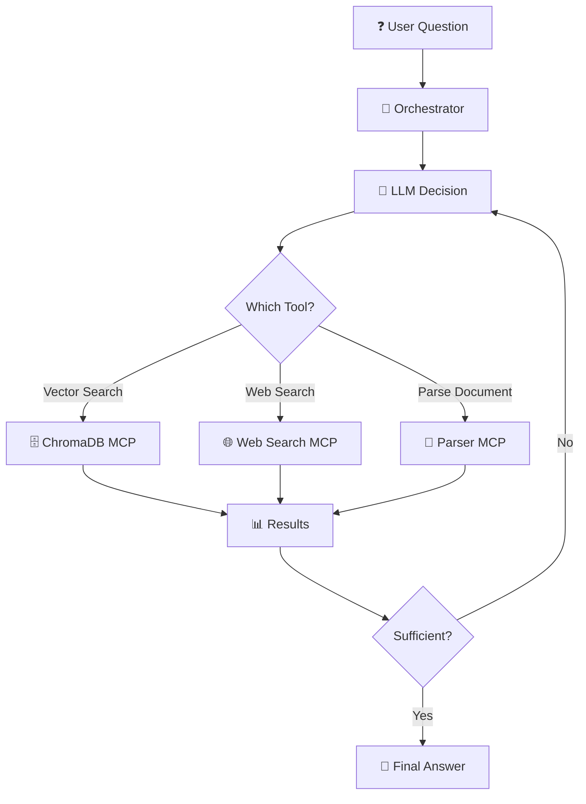

# 🎓 ULTIMATE AGENTIC DOCUMENT RAG ARCHITECTURE (End-to-End)



A modern Agentic RAG system is not magical code floating in the air. It works like a perfectly functioning company and consists of **3 Main Actors:**

1. **Orchestrator:** The company's building — the physical body that directs traffic and carries the load.
2. **LLM:** The CEO who only thinks, plans, and gives orders (The Brain).
3. **MCP Servers (Tools):** The Subcontractors who execute the actual work (Reading, Saving) in their area of expertise when they receive orders from the CEO (The Hands).

---

## 🏢 PART 1: BUILDING THE SYSTEM COMPONENTS (The Architect's Desk)

### ⚙️ STEP 1: Orchestrator (Main Code / Traffic Controller)

**Role:** This is your 24/7 running main server. It receives the message from the user, takes it to the LLM, catches the "Run this tool" JSON commands that the LLM issues, and physically executes those MCPs — it's the muscle that carries the heavy data behind the scenes.

**Architect's Options:**

#### 🐍 Code-First Orchestrators (For Developers):

- **LangGraph (Python/JS):** Industry standard. The most mature and powerful framework for building cyclic agent networks. Manages complex flows with state machine logic, handles even long-running tasks with checkpoint/resume support.
- **LlamaIndex Workflows:** The most optimized scaffold in the world specifically for Document/RAG processes. If your only concern is document processing and querying, this gives you results with minimal friction.
- **CrewAI:** Chosen for running multiple agents simultaneously in a role-based fashion (one reads, another summarizes, a third validates). Set up with simple YAML config.
- **AG2 (formerly AutoGen — Microsoft):** Microsoft's rewritten framework for multi-agent orchestration. Builds inter-agent debate and consensus flows with its group chat architecture.
- **Pydantic AI:** A type-safe, minimalist agent framework. Builds reliable agents through tool definitions and output validation via Pydantic models. Ideal for small-to-medium scale projects.
- **Custom FastAPI:** Pure code written with your own `while` loop, without any library. Full control, but you write all the orchestration logic yourself.

#### ☁️ Cloud Orchestration Platforms (Managed / No Server Required):

- **OpenAI Agents SDK (formerly Swarm):** OpenAI's official agent framework. Transfers tasks between agents via handoff mechanism. The easiest starting point if you're tied to the OpenAI ecosystem.
- **Amazon Bedrock Agents:** A fully managed agent service within the AWS ecosystem. Works integrated with Lambda, S3, and Knowledge Bases. Zero infrastructure management.
- **Google Vertex AI Agent Builder (ADK):** Agent development platform on Google Cloud. Offers native integration with Gemini models, grounding, and search capabilities.

#### 🖱️ Visual Interface Orchestrators (Low-Code / No-Code):

- **Dify.ai:** A powerful open-source platform where you build RAG pipelines by connecting boxes in a visual interface without writing code. Runs on your own server or in the cloud. Has MCP support.
- **Flowise:** A lightweight and fast tool that connects LangChain/LlamaIndex components via drag-and-drop. Excellent for prototyping.
- **n8n:** Although it's a general-purpose automation platform, you can build RAG flows with its powerful AI Agent nodes. Very easy to connect to business processes with 400+ integration support.
- **Langflow:** The official visual editor of the LangChain ecosystem. You can design complex agent flows without writing code.

---

### 🧠 STEP 2: The Agent's Brain (CEO / LLM Selection)

**Role:** The brain that looks at the question or document brought by the Orchestrator and decides "I need this particular MCP worker."

**Critical Rule:** The selected model's API must absolutely have **tools (Tool Calling / Function Calling)** capability!

**Architect's Options:**

#### ☁️ Cloud Models (If data can leave the premises):

| Model | Strength | Use Case |
|-------|----------|----------|
| **Claude Sonnet 4** (Anthropic) | Tool selection precision, long context (200K), compliance with complex instructions | Multi-step agent flows, document analysis |
| **GPT-4.1** (OpenAI) | Broad ecosystem, strong function calling, 1M context | General-purpose agent systems |
| **Gemini 2.5 Pro** (Google) | 1M+ context window, multimodal (vision+text), fast | Analyzing very large documents in a single pass |
| **Gemini 2.5 Flash** (Google) | Low cost, high speed, sufficient intelligence | High-volume query systems, budget-friendly projects |
| **Claude Haiku 4.5** (Anthropic) | Very low cost, fast response | Simple routing, intent classification, pre-filter layer |

> 💡 **Cost Optimization Tip:** By using cheap-fast models like Haiku/Flash for simple tasks such as gate security and intent classification, and powerful models like Sonnet/GPT-4.1/Gemini Pro for the actual answer generation, you can build a **tiered LLM architecture**. This approach can reduce costs by 60-80%.

#### 🖥️ Local Models (If data must stay on-premises):

| Model | Parameters | Strength | Runtime |
|-------|------------|----------|---------|
| **Qwen3-235B-A22B (MoE)** | 235B (22B active) | Multilingual including Turkish, cloud-level performance in tool calling | vLLM, SGLang |
| **Qwen3-32B** | 32B | Runs on a single GPU (A100/H100), cost-performance champion | vLLM, Ollama, SGLang |
| **Llama 4 Maverick (MoE)** | 400B (17B active) | Meta's latest model, strong reasoning and tool use | vLLM, SGLang |
| **Llama 4 Scout** | 109B (17B active) | 10M context window, long document processing | vLLM |
| **DeepSeek-R1** | 671B (37B active) | Deep reasoning, complex analysis tasks | vLLM, SGLang |
| **Mistral Medium 3** | 73B | Strong in European/multilingual tasks, fast | vLLM, Ollama |

**Local Model Server Options:**

- **vLLM:** Industry standard. High throughput with PagedAttention, continuous batching, tensor parallelism. Number one for production.
- **SGLang:** Next-generation server alternative to vLLM. With RadixAttention, it can be faster than vLLM especially in multi-turn agent loops.
- **Ollama:** Developer-friendly, single-command setup. Ideal for prototyping and small-scale deployment. vLLM or SGLang is preferred for production.

---

### 👀 STEP 3: Reader Workers (Parser MCP Options)

**Role:** The "Eyes" that overcome the LLM's blindness. They take the file uploaded by the user, clean it with their own internal intelligence, and convert it into structurally intact Markdown (.md) text, then hand it to the Orchestrator. (They do not save to the database).

**Architect's Options (Multiple can be connected depending on document difficulty):**

#### 1. Universal Swiss Army Knives:

- **unstructured-mcp:** Word, HTML, Email, plain PDF... It swallows and cleans whatever dirty format exists in the company. Automatically segments documents with partition strategies. Available as both open-source and Unstructured API (cloud).
- **markitdown-mcp (Microsoft):** A lightweight tool that very quickly converts standard Office documents (Word, Excel, PowerPoint, PDF, HTML, images) to Markdown. First choice for standard documents that don't require heavy processing.

#### 2. Tough Table, PDF, and Visual Specialists (Local):

- **docling-mcp (IBM):** The new generation favorite. Flawlessly understands heading hierarchies, images, formulas, and complex multi-column articles in PDFs. Performs layout detection with the DocLayNet model. First choice for academic papers and technical documents.
- **paddleocr-mcp:** The king that outputs Markdown without breaking the table layout (thanks to PP-Structure) for poorly scanned documents, stamped papers, and complex invoices. Strong Turkish OCR support.
- **marker-mcp / surya-mcp (Datalab):** A wonderful deep learning (Vision) based PDF→Markdown converter. The Surya OCR engine supports 90+ languages. Strong table, formula, and diagram recognition capabilities.
- **megaparse-mcp (Quivr):** A meta-parser that unifies Unstructured, LlamaParse, and its own Vision pipeline under one roof. Works with an "automatically select the best result" approach.

#### 3. Cloud Enterprise Document Specialists:

- **llama-parse-mcp (LlamaIndex):** A specialized API for deeply nested diabolical financial Excel/PDF tables. Also analyzes visuals with multimodal parsing. Delivers the highest accuracy rate in complex table structures.
- **azure-document-intelligence-mcp (Microsoft):** The system that best understands the layout of invoices, IDs, receipts, and forms. Recognizes standard document types out-of-the-box with its pre-trained models.
- **google-document-ai-mcp (Google Cloud):** Enterprise OCR solution alternative to Azure. Offers broad document type support with 60+ pre-trained document processors (invoices, bank statements, W-2 forms, etc.).

#### 4. Vision-LLM Based Parsing (Next-Generation Approach):

> 💡 **2025 Trend:** Instead of traditional OCR pipelines, sending the document image directly to **Vision-capable LLMs** for extraction is becoming increasingly common. This approach can yield better results than traditional parsers, especially for documents with complex layouts and multiple formats.

- **Gemini 2.5 Flash + PDF/Image Input:** Sending PDF pages as images to Google's multimodal model to get Markdown output. Offers high quality at low cost.
- **Claude Sonnet 4 + Vision:** Visually reads complex tables and diagrams and converts them to structured output. Context understanding capability is very strong.
- **Qwen2.5-VL / InternVL3 (Local):** Vision-Language models that can run locally. Used for LLM-based parsing in projects requiring data privacy.

> ⚠️ **Caution:** Vision-LLM parsing is slower and more expensive compared to traditional OCR. Traditional parsers are still preferred for high-volume (thousands of pages) operations. The ideal approach is a **Traditional parser + Vision-LLM verification** hybrid pipeline.

---

### 💾 STEP 4: Memory Worker (Vector DB and Embedding MCP)

**Role:** Receives the massive text produced by the Reader MCP; splits it into logical pieces (Chunking), vectorizes it, and saves it to the database. Also searches that database when needed.

**Architect's Options:** Connect `qdrant-mcp`, `milvus-mcp`, or `chroma-mcp` to the system.

**Internal Settings (Config):** The architect writes the following into the configuration file when setting up this tool:

#### Embedding Model Selection:

| Model | Type | Strength | Use Case |
|-------|------|----------|----------|
| **bge-m3** (BAAI) | Local | 100+ languages including Turkish, dense+sparse+colbert triple vector | First choice for multilingual document projects |
| **multilingual-e5-large-instruct** (Microsoft) | Local | Instruction-tuned, multilingual, high quality | Multilingual enterprise projects |
| **nomic-embed-text-v2-moe** (Nomic) | Local | MoE architecture, lightweight but powerful, Matryoshka support | Resource-constrained environments |
| **text-embedding-3-large** (OpenAI) | Cloud | Dimension reduction (Matryoshka), high quality | Rapid prototyping, cloud projects |
| **voyage-3-large** (Voyage AI) | Cloud | Leader in code and document embedding | Code+document mixed archives |
| **embed-v4** (Cohere) | Cloud | Multilingual, int8/binary quantization support | Cost-optimized large archives |

#### Database Engine Selection:

| Engine | Type | Strength | When to Choose? |
|--------|------|----------|-----------------|
| **Milvus / Zilliz** | Server | Billions of vectors, GPU indexing, hybrid search | Large-scale production, dynamic archives |
| **Qdrant** | Server | Rust-based high performance, filtering, sparse vector support | Medium-to-large scale, filtered searches |
| **Weaviate** | Server | GraphQL API, modular vectorization, multi-tenancy | Multi-user SaaS applications |
| **pgvector / pgvectorscale** | Plugin | Adds to existing PostgreSQL, query with SQL | Projects already using PostgreSQL |
| **ChromaDB** | Embedded | Single file, zero configuration, Python-native | Prototyping, small-static projects |

#### Chunking Strategy:

> 💡 The right chunking strategy is as important as the embedding model. Wrong chunking yields bad results even with the best model.

- **Semantic Chunking:** Splitting by semantic similarity. A new chunk starts when the topic changes. Highest quality but slowest.
- **Recursive Character Splitting:** The classic method that splits in order: Paragraph → Sentence → Character. Fast and sufficient in most cases.
- **Document-Aware Chunking (Docling/Unstructured):** Splitting based on the document's heading hierarchy. Most ideal for structured documents.
- **Late Chunking:** First feeding the entire document to the embedding model, then splitting. Minimizes context loss. Popularized by Jina AI.

---

## 🚀 PART 2: THE SYSTEM'S DYNAMIC OPERATION (Agent Loop — Agentic Loop)

All components have been defined as a list inside the Orchestrator (Main code). The user has arrived and the show begins:

### 🛑 STEP 5: Gate Security (Intent Filter / Semantic Routing)

**User writes:** "Hello, how's it going?"

**Orchestrator (Main Code):** Feeds this message to the Semantic-Router library at the gate without even taking it to the LLM. The Router says "This is chitchat, not RAG." The Orchestrator responds on its own with "Thanks, you can upload your documents for analysis" without bothering the LLM and MCPs.

If the user uploads a document or asks a document question, the Orchestrator gives approval and starts the loop.

---

### 📥 STEP 6: Large Data Management and Ingestion Loop (Ingestion Flow) ⭐ CRITICAL STAGE

**User:** "Archive this 500-page Q4 Financial Report PDF."

**Orchestrator:** Takes the user's message and file path, brings it to the LLM (CEO).

**BRAIN (LLM) Decides:** "This is a PDF. It needs to be read first." Sends the command to the Orchestrator:
```json
{"tool": "docling_mcp", "file": "report.pdf"}
```

**MUSCLE (Orchestrator) Executes:** Physically triggers the Reader MCP. The MCP converts 500 pages to Markdown and hands it to the Orchestrator.

**Orchestrator (Data Transfer Intelligence):** The Orchestrator does NOT take the 500-page text to the LLM! (If it does, tokens explode). It stores the text temporarily in RAM with a `ref_123` code and gives only summary info to the LLM:

> "Boss, reading is done, 500 pages extracted and stored under the name 'ref_123'. What shall we do now?"

**BRAIN (LLM) Makes the Second Decision:** "Great, now we need to archive this." Sends the second command to the Orchestrator:
```json
{"tool": "milvus_mcp", "operation": "save", "data_reference": "ref_123"}
```

**MUSCLE (Orchestrator) Executes:** Triggers the Memory tool, hands it the 500 pages. The Memory tool splits the text into chunks, vectorizes with bge-m3, writes to the DB. Operation complete.

---

### 🔎 STEP 7: Question Asking and Generation Loop (Retrieval & Generation)

**User:** "According to the reports in the archive, what are the Q4 VAT errors? Give me only JSON."

**Orchestrator:** Passes the message through Gate Security and brings it to the LLM.

**BRAIN (LLM) Decides:** "We need to look at the archive." Sends the command to the Orchestrator:
```json
{"tool": "milvus_mcp", "operation": "search", "query": "Q4 VAT errors"}
```

**MUSCLE (Orchestrator) Executes:** Triggers the Memory tool. The tool vectorizes the query, searches the database, and finds the 3 most relevant small Markdown chunks, handing them to the Orchestrator. The Orchestrator brings these to the LLM.

**BRAIN (LLM) Makes the Finale:** Reads those 3 small context chunks. Formats the answer with its own intelligence, strictly following the user's "Give me only JSON" rule (Guardrail).

**Orchestrator:** Takes this flawless JSON answer from the LLM, displays it on the user's screen via the Frontend, and ends the loop.

---

## 🔥 THE BIG PICTURE (FLAWLESS SYSTEM)

In this architecture;

- **Data size (Token Limit)** is solved by the Orchestrator's "Reference Transfer" intelligence.
- **The hassle of "How to read which PDF?"** is loaded onto the shoulders of specialist Parser MCPs.
- **The manual labor of "Vectorization and Search"** is hidden inside the Vector DB MCP.
- **The LLM (CEO)** is kept pure as only the brain that manages the process.

---

## ⚠️ CRITICAL POINT: Architectural Decision Based on Use Case

### 📌 Static Document Usage (System Assistant, Fixed Documents)

If your Agentic RAG system will work on **fixed and unchanging documents** (e.g.: company policies, product manuals, system documentation):

- **STEP 6 (Ingestion Flow)** is run only **once**
- Parser MCPs and Vector DB MCP can be shut down after processing documents
- Only **STEP 7 (Retrieval & Generation)** stays up continuously
- Orchestrator, LLM, and only search-performing MCP services remain active
- Database file is stored on disk and read at query time

**Advantages:** Minimum resource consumption, low cost, simple deployment, shutting down unnecessary MCP services

### 📌 Dynamic Document Usage (Document Assistant, Continuously Updated Content)

If your Agentic RAG system will operate in a structure that **continuously receives new documents** (e.g.: customer document upload system, live data feed, document assistant):

- **All MCP services (Parser + Vector DB)** must stay up continuously
- Orchestrator automatically triggers the STEP 6 loop whenever a user uploads a new document
- LLM dynamically decides which Parser MCP to use based on the incoming document
- Server-based vector databases like Milvus or Qdrant should be preferred
- New document upload operations can be performed through API endpoints

**Advantages:** Real-time updates, scalable architecture, ideal for multi-user systems, flexible document processing

---

## 💡 Conclusion: Which Architecture Should I Choose?

### 🏢 Static Usage Example: Internal Customer Support Assistant

**Scenario:** An assistant prepared for a company's customer service team. Documents: Product manuals, FAQ documents, company policies, return procedures.

**Features:**
- Documents are updated monthly or annually
- Users only ask questions, they don't upload new documents
- The system only searches the existing archive

**Architectural Decision:**
```
✅ Run only once: Parser MCPs + Vector DB (Ingestion)
✅ Always up: Orchestrator + LLM + Search MCP (Query)
❌ Can be shut down: docling-mcp, paddleocr-mcp, unstructured-mcp
```

**Result:** Keeping all MCP services up unnecessarily is a waste of resources. Document processing services are shut down, only query services run.

---

### 📄 Dynamic Usage Example: Public Document Analysis Assistant

**Scenario:** A web application where users can upload and analyze their own PDF/Word documents. Each user uploads different documents.

**Features:**
- Users continuously upload new documents
- Each document can be in a different format (PDF, Excel, Word, scanned image)
- The system instantly processes and adds each new document to the archive

**Architectural Decision:**
```
✅ Always up: Orchestrator + LLM + ALL MCPs
✅ Active: docling-mcp, paddleocr-mcp, unstructured-mcp, milvus-mcp
✅ Dynamic: LLM decides which Parser to use for each document
```

**Result:** The query pipeline alone is not sufficient, the entire Agentic loop (STEP 6 + STEP 7) must be active. Users can upload new documents at any time.

---

### 🎯 Decision Matrix

| Feature | Static (Customer Assistant) | Dynamic (Document Assistant) |
|---------|---------------------------|------------------------------|
| Document Upload | Admin only, rare | Every user, continuous |
| Parser MCPs | Off (after processing is done) | On (24/7) |
| Vector DB MCP | Search mode only | Both ingestion and search |
| Cost | Low (few services) | High (all services) |
| Flexibility | Low (fixed archive) | High (dynamic archive) |

---

### ⚡ CRITICAL POINT: Your Documents' Structure Determines the Architecture

Your system's architecture must be set up in completely different ways depending on **whether your documents are constantly changing:**

**📌 Static Documents (Unchanging Content):**
- Example: Company customer support assistant, product manual assistant, company policy bot
- Documents are prepared in advance and rarely updated
- Users only ask questions, they don't upload documents
- **Architecture:** Document processing services (Parser MCPs) run once and are shut down. Only query services stay up.

**📌 Dynamic Documents (Constantly Changing Content):**
- Example: Document analysis assistant where users can upload their own documents, PDF reader bot
- Each user uploads different documents
- The system must instantly process each new document
- **Architecture:** All services (Parser + Vector DB + Query) must stay up continuously. The LLM dynamically decides which tool to use for each document.

**💡 Simple Rule:** If your users can upload documents to the system → Dynamic architecture. If they only ask questions from pre-existing documents → Static architecture.

The power of Agentic RAG comes from the LLM deciding which tool to use based on the need. However, this flexibility does not mean that unused tools must stand ready. Choose the right architecture for your use case.