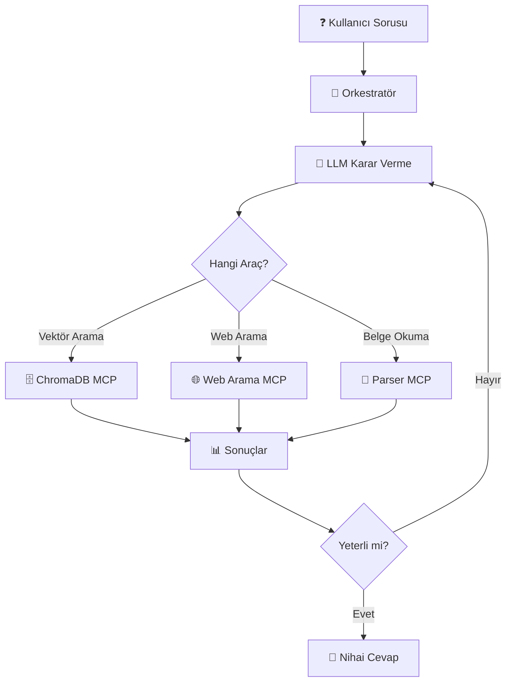

# 🎓 NİHAİ AGENTIC DOKÜMAN RAG MİMARİSİ (Uçtan Uca)



Modern Agentic (Ajan) RAG sistemi, havada uçuşan sihirli kodlar değildir. Mükemmel işleyen bir şirket gibidir ve **3 Ana Aktörden** oluşur:

1. **Orkestratör:** Şirketin binası, trafiği yöneten ve yükü taşıyan fiziksel bedendir.
2. **LLM:** Sadece düşünen, plan yapan ve emir veren Genel Müdürdür (Akıl).
3. **MCP Sunucuları (Araçlar):** Müdürden emir gelince kendi uzmanlık alanındaki işi (Okuma, Kaydetme) yapan Taşeron İşçilerdir (Eller).

---

## 🏢 KISIM 1: SİSTEM BİLEŞENLERİNİN İNŞASI (Mimarın Masası)

### ⚙️ ADIM 1: Orkestratör (Ana Kod / Trafik Polisi)

**Görev:** Senin 7/24 çalışan ana sunucundur. Kullanıcıdan mesajı alır, LLM'e götürür, LLM'in verdiği "Şu aracı çalıştır" JSON emirlerini yakalar ve gidip o MCP'leri fiziksel olarak çalıştıran, büyük veriyi el altından taşıyan kas gücüdür.

**Mimarın Seçenekleri:**

#### 🐍 Kod Odaklı (Geliştiriciler İçin):

- **LangGraph (Python/JS):** Sektör standardı. Döngüsel Ajan ağları kurmak için en mükemmel yapıdır.
- **LlamaIndex Workflows:** Sadece Doküman/RAG süreçleri üzerine dünyadaki en optimize iskelettir.
- **CrewAI / AutoGen:** Birden fazla ajanı (Biri okusun, diğeri özetlesin) aynı anda çalıştırmak için seçilir.
- **Custom FastAPI:** Hiçbir kütüphane kullanmadan, kendi while döngünüzle yazdığınız saf kod.

#### 🖱️ Görsel Arayüzlü (Low-Code):

- **Dify.ai / Flowise:** Kod yazmadan, arayüzde kutucukları bağlayarak kurduğunuz güçlü platformlar.

---

### 🧠 ADIM 2: Ajanın Beyni (Genel Müdür / LLM Seçimi)

**Görev:** Orkestratörün getirdiği soruya veya belgeye bakıp, "Benim şu MCP işçisine ihtiyacım var" diye karar veren akıldır.

**Kritik Kural:** Seçilen modelin API'sinde **tools (Araç Çağırma / Function Calling)** yeteneği kesinlikle olmalıdır!

**Mimarın Seçenekleri:**

- **☁️ Bulut (Veri dışarı çıkabiliyorsa):** Claude 3.5 Sonnet veya GPT-4o (Araç seçmede, planlamada dünyanın en zeki modelleri).
- **🖥️ Yerel (Veri şirket içinde kalacaksa):** vLLM veya Ollama üzerinde koşan Qwen-2.5-32B/72B-Instruct veya Llama-3.3-70B.

---

### 👀 ADIM 3: Okuyucu İşçiler (Parser MCP Seçenekleri)

**Görev:** LLM'in körlüğünü yenen "Gözlerdir". Kullanıcının attığı dosyayı alır, kendi içindeki zekayla temizler ve yapısı bozulmamış Markdown (.md) metnine çevirip Orkestratöre verir. (Veritabanına kaydetmez).

**Mimarın Seçenekleri (Belgenin zorluğuna göre birden fazla bağlanabilir):**

#### 1. Evrensel İsviçre Çakıları:

- **unstructured-mcp:** Word, HTML, E-posta, düz PDF... Şirkette ne kadar kirli format varsa yutar ve temizler.
- **markitdown-mcp (Microsoft):** Standart Office belgelerini çok hızlı Markdown yapan hafif araçtır.

#### 2. Zorlu Tablo, PDF ve Görsel Uzmanları (Yerel):

- **docling-mcp (IBM):** Yeni nesil favoridir. PDF'lerdeki başlık hiyerarşisini, resimleri ve çok sütunlu karmaşık makaleleri kusursuz anlar.
- **paddleocr_mcp:** Kötü taranmış belgeler, mühürlü kağıtlar ve karmaşık faturalar için (PP-Structure sayesinde) tablo düzenini hiç bozmadan Markdown çıkaran kraldır.
- **marker-mcp / surya-mcp:** Derin öğrenme (Vision) tabanlı harika bir PDF Markdown dönüştürücüsüdür.

#### 3. Bulut Kurumsal Belge Uzmanları:

- **llama-parse-mcp:** İç içe geçmiş şeytani finansal Excel/PDF tabloları için özel API.
- **azure-document-intelligence-mcp:** Fatura ve kimliklerin düzenini (Layout) en iyi anlayan sistem.

---

### 💾 ADIM 4: Hafıza İşçisi (Vector DB ve Embedding MCP)

**Görev:** Okuyucu MCP'nin ürettiği devasa metni teslim almak; onu mantıklı parçalara bölmek (Chunking), vektörlemek ve veritabanına kaydetmek. Gerektiğinde de o veritabanında arama yapmak.

**Mimarın Seçenekleri:** Sisteme `qdrant-mcp`, `milvus-mcp` veya `chroma-mcp` bağlanır.

**İç Ayarlar (Config):** Mimar bu aracı kurarken ayar dosyasına şunları yazar:

- **Embedding Modeli:** Türkçe belgeler için `bge-m3` (veya hızlı bulut için `text-embedding-3`).
- **Veritabanı Motoru:** Büyük/Dinamik arşivler için Milvus veya Qdrant; Statik/Küçük projeler için ChromaDB.

---

## 🚀 KISIM 2: SİSTEMİN DİNAMİK İŞLEYİŞİ (Ajan Döngüsü - Agentic Loop)

Bütün bileşenler Orkestratörün (Ana kodun) içine liste olarak tanımlandı. Kullanıcı ekrana geldi ve şov başladı:

### 🛑 ADIM 5: Kapı Güvenliği (Niyet Filtresi / Semantic Routing)

**Kullanıcı yazar:** "Merhaba, kolay gelsin."

**Orkestratör (Ana Kod):** Bu mesajı LLM'e hiç götürmeden kapıdaki Semantic-Router kütüphanesine sokar. Router "Bu bir sohbet, RAG değil" der. Orkestratör LLM'i ve MCP'leri yormadan kendi başına "Teşekkürler, analiz için belgelerinizi yükleyebilirsiniz" diye yanıt döner.

Eğer kullanıcı belge yükler veya belge sorusu sorarsa, Orkestratör onay verir ve döngüyü başlatır.

---

### 📥 ADIM 6: Büyük Veri Yönetimi ve Kayıt Döngüsü (Ingestion Flow) ⭐ KRİTİK AŞAMA

**Kullanıcı:** "Şu 500 sayfalık Q4 Mali Rapor PDF'ini arşive kaydet."

**Orkestratör:** Kullanıcının mesajını ve dosya yolunu alır, LLM'e (Müdür'e) götürür.

**AKIL (LLM) Karar Verir:** "Bu bir PDF. Önce okunması lazım." Orkestratöre emri yollar:
```json
{"tool": "docling_mcp", "dosya": "rapor.pdf"}
```

**KAS (Orkestratör) Uygular:** Fiziksel olarak Okuyucu MCP'yi tetikler. MCP 500 sayfayı Markdown'a çevirip Orkestratöre verir.

**Orkestratör (Veri Taşıma Zekası):** Orkestratör, 500 sayfalık metni LLM'e GÖTÜRMEZ! (Götürürse token patlar). Metni RAM'de geçici bir `ref_123` koduyla saklar ve LLM'e sadece özet bilgi verir: 

> "Müdürüm okuma bitti, 500 sayfa çıkarıldı ve 'ref_123' adıyla hafızaya alındı. Şimdi ne yapalım?"

**AKIL (LLM) İkinci Kararı Verir:** "Harika, şimdi bunu arşivlemeliyiz." Orkestratöre ikinci emri yollar:
```json
{"tool": "milvus_mcp", "islem": "kaydet", "veri_referansi": "ref_123"}
```

**KAS (Orkestratör) Uygular:** Hafıza aracını tetikler, elindeki 500 sayfayı ona verir. Hafıza aracı metni parçalara böler (chunk), bge-m3 ile vektörler, DB'ye yazar. İşlem biter.

---

### 🔎 ADIM 7: Soru Sorma ve Üretim Döngüsü (Retrieval & Generation)

**Kullanıcı:** "Arşivdeki raporlara göre Q4 KDV hataları nelerdir? Sadece JSON ver."

**Orkestratör:** Mesajı Kapı Güvenliğinden geçirip LLM'e götürür.

**AKIL (LLM) Karar Verir:** "Arşive bakmalıyız." Orkestratöre emir yollar:
```json
{"tool": "milvus_mcp", "islem": "ara", "sorgu": "Q4 KDV hataları"}
```

**KAS (Orkestratör) Uygular:** Hafıza aracını tetikler. Araç, soruyu vektörleyip veritabanında arar ve en ilgili 3 adet küçük Markdown parçasını bulup Orkestratöre verir. Orkestratör bunu LLM'e götürür.

**AKIL (LLM) Finali Yapar:** Gelen o 3 küçük bağlam parçasını okur. Kullanıcının "Sadece JSON ver" kuralına (Guardrail) harfiyen uyararak cevabı kendi zekasıyla formatlar.

**Orkestratör:** LLM'den çıkan bu kusursuz JSON cevabını alır, Frontend üzerinden kullanıcının ekranına basar ve döngüyü bitirir.

---

## 🔥 BÜYÜK RESİM (KUSURSUZ SİSTEM)

Bu mimaride;

- **Veri büyüklüğü (Token Limiti)** Orkestratör'ün "Referans Aktarımı" zekasıyla çözülmüştür.
- **"Hangi PDF nasıl okunacak?" derdi** uzman Parser MCP'lerin omuzlarına yüklenmiştir.
- **"Vektörleme ve Arama" ameleliği** Vector DB MCP'sinin içine gizlenmiştir.
- **LLM (Müdür)** sadece süreci yöneten akıl olarak saf bırakılmıştır.

---

## ⚠️ KRİTİK NOKTA: Kullanım Senaryosuna Göre Mimari Kararı

### 📌 Statik Belge Kullanımı (Sistem Asistanı, Sabit Dokümanlar)

Eğer Agentic RAG sisteminiz **sabit ve değişmeyen belgeler** üzerinde çalışacaksa (örneğin: şirket politikaları, ürün kılavuzları, sistem dokümantasyonu):

- **ADIM 6 (Ingestion Flow)** sadece **bir kere** çalıştırılır
- Parser MCP'ler ve Vector DB MCP'si belgeleri işledikten sonra kapatılabilir
- Sadece **ADIM 7 (Retrieval & Generation)** sürekli ayakta kalır
- Orkestratör, LLM ve sadece arama yapan MCP servisleri aktif olur
- Veritabanı dosyası disk üzerinde saklanır ve sorgu anında okunur

**Avantajlar:** Minimum kaynak tüketimi, düşük maliyet, basit deployment, gereksiz MCP servislerinin kapatılması

### 📌 Dinamik Belge Kullanımı (Doküman Asistanı, Sürekli Güncellenen İçerik)

Eğer Agentic RAG sisteminiz **sürekli yeni belgeler alan** bir yapıda çalışacaksa (örneğin: müşteri doküman yükleme sistemi, canlı veri akışı, doküman asistanı):

- **Tüm MCP servisleri (Parser + Vector DB)** sürekli ayakta olmalıdır
- Orkestratör, kullanıcı her yeni belge yüklediğinde ADIM 6 döngüsünü otomatik tetikler
- LLM, gelen belgeye göre hangi Parser MCP'nin kullanılacağına dinamik karar verir
- Milvus veya Qdrant gibi **sunucu tabanlı** vector database'ler tercih edilmelidir
- API endpoint'leri üzerinden yeni belge yükleme işlemleri yapılabilir

**Avantajlar:** Gerçek zamanlı güncelleme, ölçeklenebilir mimari, çok kullanıcılı sistemler için ideal, esnek belge işleme

---

## 💡 Sonuç: Hangi Mimariyi Seçmeliyim?

### 🏢 Statik Kullanım Örneği: Şirket İçi Müşteri Destek Asistanı

**Senaryo:** Bir şirketin müşteri hizmetleri ekibi için hazırlanmış asistan. Belgeler: Ürün kılavuzları, SSS dokümanları, şirket politikaları, iade prosedürleri.

**Özellikler:**
- Belgeler ayda bir veya yılda bir güncellenir
- Kullanıcılar sadece soru sorar, yeni belge yüklemez
- Sistem sadece mevcut arşivde arama yapar

**Mimari Kararı:**
```
✅ Sadece bir kere çalıştır: Parser MCP'ler + Vector DB (Ingestion)
✅ Sürekli ayakta: Orkestratör + LLM + Arama MCP'si (Query)
❌ Kapatılabilir: docling-mcp, paddleocr-mcp, unstructured-mcp
```

**Sonuç:** Gereksiz yere tüm MCP servislerini ayakta tutmak kaynak israfıdır. Belge işleme servisleri kapatılır, sadece sorgu servisleri çalışır.

---

### 📄 Dinamik Kullanım Örneği: Herkese Açık Doküman Analiz Asistanı

**Senaryo:** Kullanıcıların kendi PDF/Word belgelerini yükleyip analiz ettirebildiği web uygulaması. Her kullanıcı farklı belgeler yükler.

**Özellikler:**
- Kullanıcılar sürekli yeni belgeler yükler
- Her belge farklı formatta olabilir (PDF, Excel, Word, taranmış görsel)
- Sistem her yeni belgeyi anında işleyip arşive ekler

**Mimari Kararı:**
```
✅ Sürekli ayakta: Orkestratör + LLM + TÜM MCP'ler
✅ Aktif: docling-mcp, paddleocr-mcp, unstructured-mcp, milvus-mcp
✅ Dinamik: LLM her belgeye göre hangi Parser'ı kullanacağına karar verir
```

**Sonuç:** Sadece sorgu pipeline'ı yeterli olmaz, tüm Agentic döngü (ADIM 6 + ADIM 7) aktif olmalıdır. Kullanıcı her an yeni belge yükleyebilir.

---

### 🎯 Karar Matrisi

| Özellik | Statik (Müşteri Asistanı) | Dinamik (Doküman Asistanı) |
|---------|---------------------------|----------------------------|
| Belge Yükleme | Sadece admin, nadir | Her kullanıcı, sürekli |
| Parser MCP'ler | Kapalı (işlem bittikten sonra) | Açık (7/24) |
| Vector DB MCP | Sadece arama modu | Hem kayıt hem arama |
| Maliyet | Düşük (az servis) | Yüksek (tüm servisler) |
| Esneklik | Düşük (sabit arşiv) | Yüksek (dinamik arşiv) |

---

### ⚡ KRİTİK NOKTA: Belgelerinizin Yapısı Mimariyi Belirler

Sisteminizin mimarisi, **belgelerinizin sürekli değişip değişmediğine** göre tamamen farklı şekillerde kurulmalıdır:

**📌 Statik Belgeler (Değişmeyen İçerik):**
- Örnek: Şirket müşteri destek asistanı, ürün kılavuzu asistanı, şirket politika botu
- Belgeler önceden hazırlanır ve nadiren güncellenir
- Kullanıcılar sadece soru sorar, belge yüklemez
- **Mimari:** Belge işleme servisleri (Parser MCP'ler) bir kere çalışır ve kapatılır. Sadece sorgu servisleri ayakta kalır.

**📌 Dinamik Belgeler (Sürekli Değişen İçerik):**
- Örnek: Kullanıcıların kendi belgelerini yükleyebildiği doküman analiz asistanı, PDF okuyucu bot
- Her kullanıcı farklı belgeler yükler
- Sistem her yeni belgeyi anında işlemeli
- **Mimari:** Tüm servisler (Parser + Vector DB + Query) sürekli ayakta olmalıdır. LLM her belgeye göre hangi aracı kullanacağına dinamik karar verir.

**💡 Basit Kural:** Eğer kullanıcılarınız sisteme belge yükleyebiliyorsa → Dinamik mimari. Eğer sadece hazır belgelerden soru soruyorlarsa → Statik mimari.

Agentic RAG'ın gücü, LLM'in ihtiyaca göre hangi aracı kullanacağına karar vermesinden gelir. Ancak bu esneklik, kullanılmayan araçların da hazır beklemesi anlamına gelmez. Kullanım senaryonuza göre doğru mimariyi seçin.
