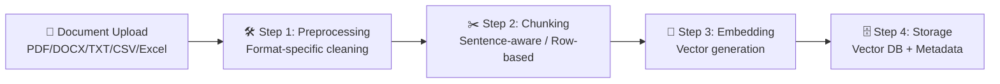

# CLASSIC RAG ARCHITECTURE (End-to-End Pipeline)

Classic RAG is a deterministic (rule-based) system where there is no thinking agent — everything is pre-coded by the architect to run like clockwork. It consists of two main pipelines: **Part 1 (Data Preparation)** and **Part 2 (User Query)**.

---

## 🏗️ PART 1: DATA PREPARATION (Data Ingestion Pipeline)

*(This part is independent of the user. It's the backend stage where company data is ingested, cleaned, and indexed into the database.)*

### 🛠️ STEP 1: Data Ingestion & Preprocessing

**Purpose:** Clean the garbage entering the system and convert documents into a pure format that machines can understand.

**Why Is It Necessary?:** If ad codes inside HTML, empty rows in Excel, or logos in PDFs enter the database raw, the system will read this junk when generating answers and hallucinate.

**How Is It Done? (Detailed Cleaning by File Type):**

#### A. Excel / Q&A
Read with the Python Pandas library. Empty (NaN/Null) rows are dropped. Date and number formats are converted to machine-readable standard formats.

#### B. HTML / Web Pages
BeautifulSoup library is used. Menus (`<nav>`), footers (`<footer>`), ads, and JavaScript code that would poison the RAG are completely removed. Only pure text bodies are extracted. Alternatively, tools like Trafilatura or MarkdownifyHTML can be used — these convert web pages directly into clean Markdown.

#### C. Scanned Images / PDFs (OCR & VLM Usage)
Read with traditional OCR engines or Next-Generation Vision AI (Vision LLM) models. PDF pages are converted to images and sent to these engines:

- **Traditional OCR Engines:** PaddleOCR (PP-Structure) or Surya OCR are used. They convert standard tables to Markdown and strip logos.

- **☁️ Cloud Vision (VLM) Models:** GPT-4.1, Claude Sonnet 4.5, or Gemini 2.5 Pro. Python code sends the image to these APIs. These models look at the page "like a human"; they convert deeply nested diabolical tables, handwriting, and infographics into flawless Markdown text and feed it back into the pipeline. Specialized document extraction APIs like Google Document AI and Azure AI Document Intelligence are also powerful alternatives for high-volume processing.

- **🖥️ Local Vision Models:** If data privacy is required and the server has a GPU, open-source Vision models are used:
  - **General VLMs:** Qwen2.5-VL (3B/7B/72B), InternVL3 (8B/78B), Llama-4-Scout-17B (Vision-capable). Qwen2.5-VL is the class leader specifically in document and table understanding.
  - **Document-Specific VLMs:** GOT-OCR 2.0, Chandra, SmolDocling (IBM). These models are trained solely for document reading and can surpass general models in table extraction and structural parsing.
  - **End-to-End Document Parsing Frameworks:** Tools like Docling (IBM) or Marker v2 combine OCR + layout analysis + Markdown output in a single pipeline. No need to manage VLMs manually.

#### D. Plain Text (Word, TXT)
Unnecessary tab spaces (`strip()`), broken Unicode characters (e.g., `\u00A0`), and broken line breaks are cleaned with Regex. Libraries like python-docx (Word) and Unstructured.io (multi-format) provide format-agnostic extraction.

---

### ✂️ STEP 2: Chunking Strategies

**Purpose:** Split massive documents into logical, bite-sized pieces that the LLM can read.

**Why Is It Necessary?:** LLMs have a memory limit (Context Window) and cannot swallow a 500-page document in one go. Additionally, the text must be split into specific chunks to perform "pinpoint" searches in the database.

**How Is It Done? (Blades by Content Type):**

#### A. Row-Based Chunking
Used only for Excel and Q&A. For example: the structure "Q: What's the VAT rate? A: 20%" is never split down the middle — it becomes a single chunk.

#### B. Header-Based Chunking
Used for HTML and Word documents. Text isn't stupidly cut at a fixed character count; paragraphs under H2 or H3 headings are cut as a whole unit. LangChain's `MarkdownHeaderTextSplitter` or LlamaIndex's `MarkdownNodeParser` automate this job.

#### C. Layout-Aware Chunking
Used for documents coming from OCR/VLM. An invoice table is never split down the middle — the entire table becomes 1 chunk. Docling and Unstructured.io handle this distinction naturally.

#### D. Recursive Character
Used for plain text. Splits text into 500-1000 character pieces while preserving sentence integrity.

#### E. Semantic Chunking [⭐ ADVANCED]
Instead of fixed sizes, it uses an embedding model to automatically split based on semantic similarity between sentences. The blade drops where meaning changes (topic transition). Implemented with LangChain `SemanticChunker` or LlamaIndex `SemanticSplitterNodeParser`. Provides smarter splitting but has higher processing cost.

#### 💡 Parent-Child Strategy
Chunks are kept small to increase search precision, but the context given to the LLM is expanded. For example: search is performed on a 200-token "child" chunk, and when found, the 1000-token "parent" paragraph that the chunk belongs to is sent to the LLM. This provides both accurate retrieval and rich context.

---

### 🔢 STEP 3: Vectorization (Embedding Model Selection)

**Purpose:** Convert text chunks into machine language (coordinates/numbers with direction and magnitude).

**Why Is It Necessary?:** Databases don't understand the meaning of words — they understand distances between numbers.

**Options (By Language and Chunk Size):**

- **🖥️ Local - bge-m3 (BAAI):** By far the most balanced model for 100+ languages. Produces both Dense and Sparse vectors (one model is enough for Hybrid Search). Can swallow massive chunks up to 8192 tokens. Consistently ranks high in the multilingual category on the MTEB leaderboard.

- **🖥️ Local - multilingual-e5-large-instruct (Microsoft):** Being instruction-tuned, it works with different prefixes for queries and documents. Offers strong multilingual performance. Has a 512-token limit.

- **🖥️ Local - paraphrase-multilingual-MiniLM-L12-v2:** Very fast, runs in seconds even on CPU. However, supports a maximum of 512 tokens. Ideal for low-resource environments and small chunks.

- **🖥️ Local - nomic-embed-text-v2-moe (Nomic AI):** Lightweight yet powerful with MoE architecture. 8192 token context, Matryoshka dimension support (adjustable between 256-768). Easily runs with Ollama.

- **☁️ Cloud - text-embedding-3-large (OpenAI):** Affordable, multilingual, and powerful API model. Dimension reduction support allows you to tune the cost-performance balance (3072 → 1536 → 256 dimensions).

- **☁️ Cloud - embed-v4 (Cohere):** Competitive with OpenAI in multilingual performance, especially strong in search quality. int8/binary quantization support reduces storage costs.

- **☁️ Cloud - Voyage 3.5 (Voyage AI):** Very strong in code and technical document embedding. Also competitive for general text. Anthropic's recommended embedding partner.

**⚡ Practical Decision:** If you're working locally on a multilingual project, start with **bge-m3**. If you're working in the cloud, **text-embedding-3-large** is the safest choice.

---

### 🗄️ STEP 4: Storage & Tagging (Vector DB & Metadata)

**Purpose:** Persistently store vectors and attach identity cards (Metadata) to them.

**Why Is It Necessary?:** When a user says "documents from 2024," the system doesn't scan the entire database — it only searches vectors tagged with `date: 2024`. (This is called Pre-filtering, and it increases speed by 10x).

**Options:**

- **🖥️ Local (Enterprise/Dynamic):**
  - **Milvus / Zilliz:** The industry standard for high-volume, distributed architectures. Offers GPU-accelerated search, Hybrid Search (Dense + Sparse), and advanced filtering support.
  - **Qdrant:** Written in Rust, extremely fast. Offers rich metadata filtering, Named Vectors (storing different embeddings for the same chunk), and Hybrid Search support. Stands up with a single Docker command.

- **🖥️ Local (Static/Small):**
  - **ChromaDB:** Python-native, works instantly like a folder. Ideal for prototyping and small projects.
  - **FAISS (Meta):** The fastest brute-force and IVF search library. No metadata filtering — pure speed.
  - **LanceDB:** Serverless, disk-based vector database. Works with zero configuration, consumes very low memory thanks to the Lance format.

- **☁️ Cloud:**
  - **Pinecone:** Fully managed (serverless) vector database. Connects via API if you don't want server costs, scaling is automatic.
  - **Weaviate Cloud:** Stands out with hybrid search and modular architecture. Offers powerful querying through GraphQL API.

**💡 Metadata Design Tip:** Attach at least these tags to every chunk: `source_file`, `page_number`, `date`, `category`. These tags are critical for both filtering and source citation in LLM answers.

---

## 🚀 PART 2: QUERYING & ANSWER GENERATION (Query Pipeline)

*(This is the process that happens within milliseconds the moment a user types a message on screen.)*

### 🛑 STEP 5: Intent Filter & Routing [⭐ OPTIONAL]

**Purpose:** Understand whether the user's message actually requires a "Document Search (RAG)" and protect the system.

**WHY IS IT NECESSARY?:** Classic RAG systems are blind. When a user just types "Hello" or "How are you?", a dumb RAG system takes this word, converts it to a vector, and goes to the DB. It finds and retrieves a random piece of text that's mathematically closest to "Hello" (but completely irrelevant). The LLM then looks at this and produces a nonsensical answer, wasting search/server costs for nothing.

**How Does It Work?:** A very fast rule or lightweight classifier is placed in between:

- **Semantic Router:** Compares the user's message against pre-defined intent vectors. If it falls below the threshold, it doesn't route to RAG. Very fast (~1ms), requires no additional LLM calls.
- **Lightweight LLM Classifier:** A small model (e.g., Qwen3-1.7B or a fine-tuned BERT) determines the message category: `chitchat`, `out_of_scope`, `rag_query`. More flexible than Semantic Router but slightly slower.

**Example Flow:**
- User says "Hello" → Do NOT search. Directly say "Hello, how can I help you?"
- User says "Give me a cake recipe" → Do NOT search. Say "I can only discuss company documents."
- User says "What's my leave entitlement?" → Approve for RAG pipeline and proceed to Step 6.

---

### 🧠 STEP 6: Query Transformation [⭐ OPTIONAL]

**Purpose:** Transform the user's short, lazily typed, or contextually dependent question into the perfect format that the database can understand.

**Why Is It Necessary?:** The user types in chat "So when did that go into effect?" There's no such thing as "that" to search in the database.

**How Does It Work?:**

- **Standalone Rewriting:** The system looks at the chat history and rewrites the query in the background: "When did the company dress code regulation go into effect?" A small and fast model (e.g., Qwen3-4B, Gemini 2.5 Flash) is used for this task instead of the main LLM to reduce costs.

- **Multi-Query:** Generates 3 different synonymous variations from a single question and searches all three (expands coverage). Results are merged (union) and deduplicated.

- **HyDE (Hypothetical Document Embeddings):** Has the LLM write a fake/hypothetical answer and searches for real documents "most similar to this hypothetical answer." Especially effective when there's a large gap between the user's query language and the document language.

- **Step-Back Prompting:** Converts a very specific question into a more general one to broaden search scope. E.g., "John's March 2024 leave" → "Employee annual leave rights and procedures."

---

### 📐 STEP 7: Similarity Search (Retrieval & Distance Metrics)

**Purpose:** Search the improved query in the database and find the most relevant document chunks.

**Why Is It Necessary?:** Since we can't give the LLM the entire company archive, we need to find only the best 3-5 paragraphs that contain the answer to the question.

**How Does It Work?:**

- **Dense (Vector) Search:** Performs semantic similarity search over dense vectors produced by the embedding model. When searching for "salary increase," it also finds "pay raise."

- **Sparse (BM25) Search:** Classic search method based on keyword matching. Superior to vector search in situations requiring exact matches like proper nouns, product codes, and technical terms.

- **Hybrid Search:** Both Dense and Sparse methods run simultaneously and results are merged into a single list using Reciprocal Rank Fusion (RRF) or weighted score combination. This is the gold standard of Classic RAG. Qdrant, Milvus, and the bge-m3 model natively support this architecture.

- **Math (Metrics):** Similarity between vectors is typically calculated using Cosine Similarity, Dot Product, or L2 (Euclidean Distance) algorithms. For normalized vectors, Cosine and Dot Product yield the same result.

---

### ⚖️ STEP 8: Reranking & A/B Testing [⭐ OPTIONAL]

**Purpose:** Take the top 20 results from the database, read them like a real human, and re-score them asking "Is this really the answer to the question?"

**Why Is It Necessary?:** The database is very fast but performs a coarse search (bi-encoder). Sometimes the #1 retrieved document doesn't actually contain the exact answer to the question. The reranker reads the question and document together (cross-encoder) for much more precise scoring.

**How Does It Work?:**

- **🖥️ Local Rerankers:**
  - **bge-reranker-v2-m3 (BAAI):** Multilingual, proven performance. Lightweight and fast.
  - **Jina Reranker v2 (jina-reranker-v2-base-multilingual):** 100+ language support, works with long chunks up to 1024 tokens.

- **☁️ Cloud Rerankers:**
  - **Cohere Rerank 3.5:** Works via API, multilingual and very powerful. Integration is extremely easy (single API call).
  - **Voyage Rerank 2:** Especially strong for technical documents and code.

- **A/B Testing:** The architect doesn't push this step straight to production. Using Ragas, DeepEval, or TruLens, they race the "with Reranker" and "without Reranker" pipelines against each other. They compare Faithfulness, Answer Relevancy, and Context Precision metrics. Only if it genuinely improves quality does it go live.

---

### 📝 STEP 9: Generation & Guardrails

**Purpose:** Read the retrieved document chunks (context) and provide the user with the final answer in natural, fluent language.

**Why Is It Necessary?:** Raw database text may be too technical or complex for the user. Additionally, the LLM must be prevented from making up things not in the documents (Hallucination).

**How Does It Work?:**

- **Safety Threshold:** If the Cosine similarity score from Step 7 comes back very low (e.g., below 0.30), the system doesn't give the document to the LLM at all — it directly says "No information found in documents." This threshold should be calibrated experimentally based on the embedding model and dataset.

- **Restrictive Prompt (Guardrail):** "You are an assistant. Use ONLY the context below. If the answer is not in the context, say 'I don't know.' Context: [1, 2, 3]. Question: [Leave policies]."

- **Source Citation:** Ask the LLM to indicate which chunks the answer came from. This allows the user to verify the answer and increases trust. Add an instruction like "At the end of each statement, show the reference in the format [Source: file_name, page X]" to the prompt.

**Answer Generation Engine (LLM) Selection:** This prepared package is sent to one of two different environments based on your infrastructure preference:

#### 🖥️ LOCAL GENERATION (For Data Privacy)
Data never leaves the company server. **vLLM** or **SGLang** for high traffic and high throughput; **Ollama** for quick setup and prototyping.

**Models (Current Recommendations):**

| Model | Size | Strength | When to Choose? |
|---|---|---|---|
| **Qwen3 ⭐** | 8B / 14B / 32B | Class leader in multilingual performance. Thinking/Non-thinking modes, excellent JSON generation, and long context support. | **Always first choice.** 8B for low hardware, 14B-32B for high quality. |
| **Llama 4 Scout** | 17B (active) | Meta's MoE model. 10M token context window. Fast and efficient. | When very long document context is needed or for English-heavy projects. |
| **Gemma 3** | 4B / 12B / 27B | Google's lightweight yet powerful model. 128K context. | Low VRAM budget environments, situations requiring fast responses. |
| **Mistral Small 3.2** | 24B | Includes Vision support. Multilingual, fast. | RAG pipelines with both text and visual input. |
| **Phi-4** | 14B | Microsoft's small but powerful model. Outperforms competitors in technical and reasoning tasks. | Low resources, high logical reasoning demands. |

> **⚡ Practical Note:** For multilingual RAG projects, the **Qwen3-14B + vLLM** combination is the best starting point in terms of cost/performance. Runs on a GPU with 8GB+ VRAM.

#### ☁️ CLOUD GENERATION (For Maximum Intelligence)
If data can leave the premises, APIs are used to avoid server costs.

**Models (Current Recommendations):**

| Model | Strength | When to Choose? |
|---|---|---|
| **Claude Sonnet 4.5 (Anthropic) ⭐** | Highest instruction adherence, complex table analysis, flawless multilingual output, low hallucination rate. | When quality is critical, for complex document analysis. |
| **GPT-4.1 (OpenAI)** | Very strong general intelligence, extensive tool ecosystem, Structured Outputs support. | For complex reasoning and when JSON-formatted output is needed. |
| **Gemini 2.5 Pro (Google)** | 1M token context window, excellent multimodal understanding, competitive pricing. | Very long documents, mixed visual + text contexts. |
| **Gemini 2.5 Flash (Google)** | Very fast, very cheap, adjustable "thinking" budget. | High-volume queries, cost optimization. |
| **GPT-4.1 mini (OpenAI)** | Cheaper and faster version of GPT-4.1. | High-traffic scenarios with thousands of queries. |
| **GPT-4.1 nano (OpenAI)** | Cheapest and fastest. Sufficient for simple extraction and classification. | Auxiliary tasks like Intent Filtering (Step 5), Query Rewriting (Step 6). |

> **💰 Cost Strategy:** Use Claude Sonnet 4.5 or GPT-4.1 for main generation. Use GPT-4.1 nano or Gemini 2.5 Flash for auxiliary tasks like Step 5 (Intent) and Step 6 (Query Rewriting) to reduce total cost by 60-80%.

---

## ⚠️ CRITICAL POINT: Architectural Decision by Use Case

### 📌 Static Document Usage (System Assistant, Fixed Documents)

If your RAG system will work on **fixed and unchanging documents** (e.g., company policies, product manuals, system documentation):

- **PART 1 (Data Preparation)** is run **only once**
- After chunking, embedding, and database upload are complete, these services can be shut down
- Only **PART 2 (Query Pipeline)** stays running continuously
- The database file (ChromaDB, FAISS, LanceDB, etc.) is stored on disk and read at query time

**Advantages:** Minimum resource consumption, low cost, simple deployment

### 📌 Dynamic Document Usage (Document Assistant, Continuously Updated Content)

If your RAG system will operate in a structure that **continuously receives new documents** (e.g., customer document upload system, live data feed):

- **Both PART 1 and PART 2** services must be **continuously running**
- New documents must be automatically processed and added to the database when they arrive
- **Server-based** vector databases like Milvus or Qdrant should be preferred
- New document upload operations can be performed via API endpoints
- A **version management** strategy should be established for deleting or updating old/invalid documents

**Advantages:** Real-time updates, scalable architecture, ideal for multi-user systems

---

## 📊 BONUS: Evaluation & Monitoring

*(How do you know if your system is actually working?)*

Key metrics you must continuously measure before and after pushing your RAG pipeline to production:

- **Faithfulness:** Is the LLM's answer actually faithful to the given context (chunks), or is it making things up?
- **Answer Relevancy:** Does the answer actually answer the question asked?
- **Context Precision:** Are the retrieved chunks actually relevant to the question?
- **Context Recall:** Is all the information needed for the answer present in the chunks?

**Tools:** You can automatically measure these metrics with Ragas, DeepEval, Phoenix (Arize AI), LangSmith, or TruLens.

---

---

## 🔌 Extensibility Points

> The demo pipeline in this repository demonstrates the core RAG flow. The following advanced capabilities are intentionally left as extensibility points for you to integrate based on your project needs.

### 🔍 OCR Integration

**Note:** This demo does not implement the OCR step. For scanned documents, you can integrate:

- **PaddleOCR (Local):** `pip install paddleocr` — Supports 80+ languages including Turkish. PP-Structure module handles table extraction. Requires local installation and ~2GB disk space.
- **Tesseract (Local):** `pip install pytesseract` + system Tesseract installation. Lightweight but less accurate on complex layouts.
- **Cloud Vision APIs:** Google Gemini Vision, Claude Vision, or GPT-4 Vision. Send document images via API for high-accuracy extraction. No local setup required but incurs API costs.

**Why excluded from demo:** OCR requires local binary installations (PaddleOCR, Tesseract) or API keys for cloud services, adding setup complexity that would hinder quick demo evaluation.

### ⚖️ Reranking Integration

**Note:** This demo does not implement the Reranking step. You can improve search quality by adding:

- **bge-reranker-v2-m3 (BAAI):** Multilingual cross-encoder reranker. `pip install FlagEmbedding`
- **Cohere Rerank 3.5:** Cloud API reranker. Single API call integration.
- **Jina Reranker v2:** 100+ language support, handles long chunks up to 1024 tokens.

**Benefits of Reranking:**
- Eliminates irrelevant results from initial retrieval
- Improves ranking quality with cross-encoder scoring
- Enhances the context sent to the LLM for better answer generation
- Typically improves Faithfulness and Context Precision metrics by 10-20%

---

**💡 Conclusion:** When designing your project, clearly define your use case. Keeping all services running unnecessarily for static usage is a waste of resources; for dynamic usage, just the query pipeline is not enough. Choosing the right model and tool at each step directly determines both the quality and cost of your system.