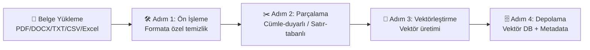
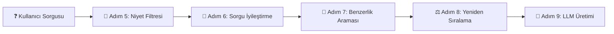

# KLASİK RAG MİMARİSİ (Uçtan Uca Boru Hattı)

Klasik RAG, düşünen bir ajanın olmadığı, her şeyin mimar tarafından önceden saat gibi işleyecek şekilde kodlandığı deterministik (kesin kurallı) bir sistemdir. İki ana hattan oluşur: **Kısım 1 (Veri Hazırlığı)** ve **Kısım 2 (Kullanıcı Sorgusu)**.

---

## 🏗️ KISIM 1: VERİ HAZIRLIĞI (Data Ingestion Pipeline)

*(Bu kısım kullanıcıdan bağımsızdır. Arka planda şirketin verilerinin yutulup, temizlenip veritabanına dizildiği aşamadır.)*

### 🛠️ ADIM 1: Veri Alma ve Ön İşleme (Preprocessing)

**Amaç:** Sisteme giren çöpleri temizlemek ve belgeleri makinenin anlayacağı saf formata çevirmek.

**Neden Gerekli?:** HTML içindeki reklam kodları, Excel'deki boş satırlar veya PDF'lerdeki logolar veritabanına ham girerse, sistem cevap üretirken bu çöpleri okuyup halüsinasyon görür.

**Nasıl Yapılır? (Dosya Türüne Göre Detaylı Temizlik):**

#### A. Excel / Soru-Cevap (Q&A)
Python Pandas kütüphanesi ile okunur. Boş (NaN/Null) satırlar düşürülür. Tarih ve sayı formatları makinenin anlayacağı standart formata çevrilir.

#### B. HTML / Web Sayfaları
BeautifulSoup kütüphanesi kullanılır. RAG'ı zehirleyecek olan menüler (`<nav>`), altbilgiler (`<footer>`), reklamlar ve JavaScript kodları tamamen silinir. Sadece saf metin gövdeleri alınır. Alternatif olarak Trafilatura veya MarkdownifyHTML gibi araçlar da kullanılabilir; bunlar web sayfalarını doğrudan temiz Markdown'a çevirir.

#### C. Taranmış Resim / PDF (OCR ve VLM Kullanımı)
Geleneksel OCR motorları veya Yeni Nesil Görsel Yapay Zeka (Vision LLM) modelleriyle okunur. PDF sayfaları resme çevrilip bu motorlara yollanır:

- **Geleneksel OCR Motorları:** PaddleOCR (PP-Structure) veya Surya OCR kullanılır. Standart tabloları Markdown'a çevirir, logoları silerler.

- **☁️ Bulut Vision (VLM) Modelleri:** GPT-4.1, Claude Sonnet 4.5 veya Gemini 2.5 Pro. Python kodu resmi bu API'lere yollar. Bu modeller sayfaya "insan gibi" bakar; iç içe geçmiş şeytani tabloları, el yazılarını ve infografikleri kusursuz bir Markdown metnine çevirip boru hattına geri verir. Google Document AI ve Azure AI Document Intelligence gibi özel doküman çıkarım API'leri de yüksek hacimli işlemler için güçlü alternatiflerdir.

- **🖥️ Yerel (Local) Vision Modelleri:** Veri gizliliği şartsa ve sunucuda GPU varsa açık kaynaklı Vision modeller kullanılır:
  - **Genel VLM'ler:** Qwen2.5-VL (3B/7B/72B), InternVL3 (8B/78B), Llama-4-Scout-17B (Vision destekli). Qwen2.5-VL özellikle belge ve tablo anlama konusunda sınıfının lideridir.
  - **Doküman-Spesifik VLM'ler:** GOT-OCR 2.0, Chandra, SmolDocling (IBM). Bu modeller sadece doküman okumak için eğitilmiş olup tablo çıkarımı ve yapısal çözümlemede genel modellerin önüne geçebilir.
  - **Uçtan Uca Doküman Çözümleme Framework'leri:** Docling (IBM) veya Marker v2 gibi araçlar OCR + layout analizi + Markdown çıktısını tek bir pipeline'da birleştirir. Elle VLM yönetmeye gerek kalmaz.

#### D. Düz Metin (Word, TXT)
Gereksiz sekme boşlukları (`strip()`), bozuk Unicode karakterler (Örn: `\u00A0`) ve kırık satırlar Regex algoritmalarıyla temizlenir. python-docx (Word) ve Unstructured.io (çoklu format) gibi kütüphaneler format-agnostik çıkarım sağlar.

---

### ✂️ ADIM 2: Parçalama (Chunking) Stratejileri

**Amaç:** Dev belgeleri, LLM'in okuyabileceği mantıklı ve küçük lokmalara ayırmak.

**Neden Gerekli?:** LLM'lerin bir hafıza sınırı (Context Window) vardır ve 500 sayfalık bir belgeyi tek seferde yutamaz. Ayrıca veritabanında "nokta atışı" arama yapabilmek için metnin spesifik parçalara bölünmüş olması şarttır.

**Nasıl Yapılır? (İçerik Türüne Göre Bıçaklar):**

#### A. Satır Tabanlı (Row-Based) Chunking
Sadece Excel ve Q&A için kullanılır. Örn: "Soru: KDV kaç? Cevap: %20" yapısı asla ortadan ikiye bölünmez, tek bir lokma (chunk) yapılır.

#### B. Başlık Tabanlı (Header) Chunking
HTML ve Word için kullanılır. Metin aptalca sabit kelimeden kesilmez; H2 veya H3 başlıklarının altındaki paragraflar bir bütün olarak kesilir. LangChain'in `MarkdownHeaderTextSplitter` veya LlamaIndex'in `MarkdownNodeParser` bileşenleri bu işi otomatikleştirir.

#### C. Düzene Duyarlı (Layout-Aware) Chunking
OCR/VLM'den gelen belgelerde kullanılır. Bir fatura tablosu ortadan ikiye bölünmez, tablonun tamamı 1 chunk yapılır. Docling ve Unstructured.io bu ayrımı doğal olarak yapar.

#### D. Özyinelemeli (Recursive Character)
Düz metinler için kullanılır. Cümle bütünlüğünü koruyarak metni 500-1000 karakterlik parçalara böler.

#### E. Semantik (Semantic) Chunking [⭐ İLERİ SEVİYE]
Sabit boyut yerine, bir embedding modeli kullanarak cümlelerin anlamsal yakınlığına göre otomatik bölme yapar. Anlam değiştiği yerde (konu geçişi) bıçak düşer. LangChain `SemanticChunker` veya LlamaIndex `SemanticSplitterNodeParser` ile uygulanır. Daha akıllı bölme sağlar ancak işlem maliyeti daha yüksektir.

#### 💡 Parent-Child (Ebeveyn-Çocuk) Stratejisi
Chunk'lar küçük tutularak arama hassasiyeti artırılır, ancak LLM'e verilen bağlam genişletilir. Örn: Arama 200 tokenlık "çocuk" chunk'ta yapılır, bulununca o chunk'ın ait olduğu 1000 tokenlık "ebeveyn" paragraf LLM'e gönderilir. Bu, hem isabetli arama hem de zengin bağlam sağlar.

---

### 🔢 ADIM 3: Vektörleştirme (Embedding Modeli Seçimi)

**Amaç:** Metin parçalarını makine diline (yönü ve büyüklüğü olan koordinatlara / sayılara) çevirmek.

**Neden Gerekli?:** Veritabanları kelimelerin anlamını bilmez, sayılar arası mesafeleri bilir.

**Seçenekler (Dile ve Chunk Boyutuna Göre):**

- **🖥️ Yerel - bge-m3 (BAAI):** Türkçe dahil 100+ dil için açık ara en dengeli modeldir. Hem Dense hem Sparse vektör üretir (Hybrid Search için tek model yeter). 8192 token'a kadar devasa chunk'ları yutabilir. MTEB liderlik tablosunda çok dilli kategoride sürekli üst sıralardadır.

- **🖥️ Yerel - multilingual-e5-large-instruct (Microsoft):** Instruction-tuned olması sayesinde sorgu ve doküman için farklı prefix'lerle çalışır. Türkçe dahil güçlü çok dilli performans sunar. 512 token limiti vardır.

- **🖥️ Yerel - paraphrase-multilingual-MiniLM-L12-v2:** Çok hızlıdır, CPU'da bile saniyeler içinde çalışır. Ancak maksimum 512 token destekler. Düşük kaynaklı ortamlar ve küçük chunk'lar için idealdir.

- **🖥️ Yerel - nomic-embed-text-v2-moe (Nomic AI):** MoE mimarisiyle hafif ama güçlüdür. 8192 token context, Matryoshka boyut desteği (256-768 arası ayarlanabilir). Ollama ile kolayca çalıştırılabilir.

- **☁️ Bulut - text-embedding-3-large (OpenAI):** Ucuz, çok dilli ve güçlü API modelidir. Boyut kısaltma (dimension reduction) desteği sayesinde maliyet-performans dengesini ayarlayabilirsiniz (3072 → 1536 → 256 boyut).

- **☁️ Bulut - embed-v4 (Cohere):** Çok dilli performansta OpenAI'a rakip, özellikle arama kalitesinde güçlüdür. int8/binary quantization desteği ile depolama maliyetini düşürür.

- **☁️ Bulut - Voyage 3.5 (Voyage AI):** Kod ve teknik doküman embedding'inde çok güçlüdür. Genel metin için de rekabetçidir. Anthropic'in önerdiği embedding partnerıdır.

**⚡ Pratik Karar:** Türkçe ağırlıklı bir projede yerel çalışacaksanız **bge-m3** ile başlayın. Bulutta çalışıyorsanız **text-embedding-3-large** en güvenli seçimdir.

---

### 🗄️ ADIM 4: Depolama ve Etiketleme (Vector DB & Metadata)

**Amaç:** Vektörleri kalıcı olarak saklamak ve onlara kimlik kartları (Metadata) yapıştırmak.

**Neden Gerekli?:** Kullanıcı "2024 yılındaki belgeler" dediğinde sistem tüm veritabanını taramaz, sadece `date: 2024` etiketli vektörlerde arama yapar. (Buna Pre-filtering denir, hızı 10 kat artırır).

**Seçenekler:**

- **🖥️ Yerel (Kurumsal/Dinamik):**
  - **Milvus / Zilliz:** Yüksek hacimli, dağıtık mimariler için endüstri standardıdır. GPU-accelerated arama, Hybrid Search (Dense + Sparse) ve gelişmiş filtreleme desteği sunar.
  - **Qdrant:** Rust ile yazılmış, çok hızlıdır. Zengin metadata filtreleme, Named Vectors (aynı chunk için farklı embedding'ler saklama) ve Hybrid Search desteği sunar. Docker ile tek komutla ayağa kalkar.

- **🖥️ Yerel (Statik/Küçük):**
  - **ChromaDB:** Python-native, klasör gibi anında çalışır. Prototipleme ve küçük projeler için idealdir.
  - **FAISS (Meta):** En hızlı brute-force ve IVF arama kütüphanesidir. Metadata filtreleme yoktur, saf hız içindir.
  - **LanceDB:** Serverless, disk-tabanlı vektör veritabanıdır. Sıfır yapılandırma ile çalışır, Lance formatı sayesinde çok düşük bellek tüketir.

- **☁️ Bulut:**
  - **Pinecone:** Tam yönetimli (serverless) vektör veritabanıdır. Sunucu masrafı istenmiyorsa API ile bağlanır, ölçekleme otomatiktir.
  - **Weaviate Cloud:** Hibrit arama ve modüler yapısıyla öne çıkar. GraphQL API ile güçlü sorgulama imkanı sunar.

**💡 Metadata Tasarım İpucu:** Her chunk'a en az şu etiketleri yapıştırın: `source_file`, `page_number`, `date`, `category`. Bu etiketler hem filtreleme hem de LLM cevabına kaynak gösterme (citation) için kritiktir.

---

## 🚀 KISIM 2: SORGULAMA VE CEVAP ÜRETİMİ (Query Pipeline)

*(Kullanıcı ekrana mesaj yazdığı an milisaniyeler içinde gerçekleşen süreçtir.)*

### 🛑 ADIM 5: Niyet Filtresi ve Yönlendirme (Intent Routing) [⭐ OPSİYONEL]

**Amaç:** Kullanıcının mesajının gerçekten bir "Belge Araması (RAG)" gerektirip gerektirmediğini anlamak ve sistemi korumak.

**NEDEN GEREKLİ?:** Klasik RAG sistemleri kördür. Kullanıcı sadece "Merhaba" veya "Nasılsın?" yazdığında, aptal bir RAG sistemi bu kelimeyi alır, vektöre çevirir ve DB'ye gider. "Merhaba" kelimesine matematiksel olarak en yakın olan (ama alakası olmayan) rastgele bir metni bulup getirir. LLM de buna bakarak saçma sapan bir cevap üretir ve boş yere arama/sunucu maliyeti harcanır.

**Nasıl Çalışır?:** Araya çok hızlı çalışan bir kural veya hafif bir sınıflandırıcı konur:

- **Semantic Router:** Önceden tanımlanmış niyet vektörleriyle kullanıcı mesajını karşılaştırır. Eşik altında kalırsa RAG'a yönlendirmez. Çok hızlıdır (~1ms), ek LLM çağrısı gerektirmez.
- **Hafif LLM Sınıflandırıcı:** Küçük bir model (Örn: Qwen3-1.7B veya bir fine-tuned BERT) mesajın kategorisini belirler: `chitchat`, `out_of_scope`, `rag_query`. Semantic Router'dan daha esnek ama biraz daha yavaştır.

**Örnek Akış:**
- Kullanıcı "Merhaba" derse → Arama YAPMA. Direkt "Merhaba, size nasıl yardımcı olabilirim?" de.
- Kullanıcı "Kek tarifi ver" derse → Arama YAPMA. "Sadece şirket belgeleri hakkında konuşabilirim" de.
- Kullanıcı "İzin hakkım nedir?" derse → RAG boru hattına onay ver ve Adım 6'ya geç.

---

### 🧠 ADIM 6: Sorgu İyileştirme (Query Transformation) [⭐ OPSİYONEL]

**Amaç:** Kullanıcının kısa, tembelce veya devrik yazdığı soruyu, veritabanının anlayacağı mükemmel formata çevirmek.

**Neden Gerekli?:** Kullanıcı sohbette "Peki o ne zaman yürürlüğe girdi?" yazar. Veritabanında "O" diye bir şey aranmaz.

**Nasıl Çalışır?:**

- **Standalone Rewriting:** Sistem geçmiş sohbete bakar ve soruyu arka planda yeniden yazar: "Şirket kılık kıyafet yönetmeliği ne zaman yürürlüğe girdi?" Bu iş için ana LLM yerine küçük ve hızlı bir model (Örn: Qwen3-4B, Gemini 2.5 Flash) kullanılarak maliyet düşürülür.

- **Multi-Query:** Tek sorudan 3 farklı eşanlamlı varyasyon üretip üçünü de arar (Kapsamı genişletir). Sonuçlar birleştirilip (union) tekil hale getirilir.

- **HyDE (Hypothetical Document Embeddings):** LLM'e sahte/hayali bir cevap yazdırır ve "Bu hayali cevaba en çok benzeyen" gerçek belgeleri arar. Özellikle kullanıcının sorusu ile belgenin dili arasında büyük fark olduğu durumlarda etkilidir.

- **Step-Back Prompting:** Çok spesifik bir soruyu daha genel bir soruya çevirerek arama kapsamını genişletir. Örn: "Ahmet Bey'in 2024 Mart izni" → "Çalışan yıllık izin hakları ve prosedürü."

---

### 📐 ADIM 7: Benzerlik Araması (Retrieval & Distance Metrics)

**Amaç:** İyileştirilmiş soruyu veritabanında aratıp en alakalı belge parçacıklarını (Chunk'ları) bulmak.

**Neden Gerekli?:** LLM'e tüm şirketin arşivini veremeyeceğimiz için, sadece sorunun cevabını barındıran en iyi 3-5 paragrafı bulmamız gerekir.

**Nasıl Çalışır?:**

- **Dense (Vektör) Arama:** Embedding modeli ile üretilmiş yoğun vektörler üzerinden anlamsal benzerlik araması yapar. "Maaş artışı" ararken "ücret zammı" da bulur.

- **Sparse (BM25) Arama:** Kelime eşleşmesine dayalı klasik arama yöntemidir. Özel isimler, ürün kodları ve teknik terimler gibi tam eşleşme gereken durumlarda vektör aramasından üstündür.

- **Hybrid Search (Hibrit Arama):** Hem Dense hem de Sparse yöntemler aynı anda çalıştırılıp sonuçlar Reciprocal Rank Fusion (RRF) veya ağırlıklı skor birleştirme ile tek bir listeye indirgenir. Klasik RAG'ın altın standardıdır. Qdrant, Milvus ve bge-m3 modeli bu yapıyı doğal olarak destekler.

- **Matematik (Metrikler):** Vektörler arasındaki benzerlik genellikle Kosinüs (Cosine Similarity), Dot Product veya L2 (Öklid Mesafesi) algoritmalarıyla hesaplanır. Normalize edilmiş vektörlerde Cosine ve Dot Product aynı sonucu verir.

---

### ⚖️ ADIM 8: Yeniden Sıralama ve A/B Testi (Reranking) [⭐ OPSİYONEL]

**Amaç:** Veritabanından gelen en iyi 20 sonucu, gerçek bir insan gibi okuyup "Gerçekten sorunun cevabı bu mu?" diye tekrar puanlamak.

**Neden Gerekli?:** Veritabanı çok hızlıdır ama kaba bir arama yapar (bi-encoder). Bazen getirdiği 1. sıradaki belge aslında sorunun tam cevabını içermez. Reranker ise soru ve belgeyi birlikte okuyarak (cross-encoder) çok daha hassas puanlama yapar.

**Nasıl Çalışır?:**

- **🖥️ Yerel Reranker'lar:**
  - **bge-reranker-v2-m3 (BAAI):** Çok dilli, Türkçe'de kanıtlanmış performans. Hafif ve hızlıdır.
  - **Jina Reranker v2 (jina-reranker-v2-base-multilingual):** 100+ dil desteği, 1024 token'a kadar uzun chunk'larla çalışır.

- **☁️ Bulut Reranker'lar:**
  - **Cohere Rerank 3.5:** API ile çalışır, çok dilli ve çok güçlüdür. Entegrasyonu çok kolaydır (tek API çağrısı).
  - **Voyage Rerank 2:** Teknik dokümanlar ve kod için özellikle güçlüdür.

- **A/B Testi:** Mimar bu adımı direkt canlıya almaz. Ragas, DeepEval veya TruLens ile "Reranker'lı" ve "Reranker'sız" hattı yarıştırır. Faithfulness, Answer Relevancy ve Context Precision metriklerini karşılaştırır. Gerçekten kaliteyi artırıyorsa yayına alır.

---

### 📝 ADIM 9: Üretim ve Güvenlik Rayları (Generation & Guardrails)

**Amaç:** Bulunan belge parçalarını (bağlamı) okuyarak kullanıcıya doğal ve akıcı bir dille nihai cevabı vermek.

**Neden Gerekli?:** Ham veritabanı metni kullanıcı için çok teknik veya karmaşık olabilir. Ayrıca LLM'in belgelerde olmayan bir şeyi uydurmasını (Halüsinasyon) engellemek gerekir.

**Nasıl Çalışır?:**

- **Güvenlik Eşiği (Threshold):** Eğer Adım 7'deki arama sonucunda Kosinüs benzerlik skoru çok düşük (örn: 0.30 altı) gelmişse, sistem belgeyi LLM'e hiç vermez, direkt "Belgelerde bilgi bulunamadı" der. Bu eşik, embedding modeline ve veri setine göre deneysel olarak kalibre edilmelidir.

- **Kısıtlayıcı Prompt (Guardrail):** "Sen bir asistansın. SADECE aşağıdaki bağlamı kullan. Eğer bağlamda cevap yoksa 'Bilmiyorum' de. Bağlam: [1, 2, 3]. Soru: [İzinler]."

- **Kaynak Gösterme (Citation):** LLM'den cevabın hangi chunk'lardan geldiğini belirtmesini isteyin. Bu, kullanıcının cevabı doğrulayabilmesini sağlar ve güveni artırır. Prompt'a "Her cümlenin sonunda [Kaynak: dosya_adı, sayfa X] formatında referans göster" gibi bir talimat ekleyin.

**Cevap Üretici Motor (LLM) Seçimi:** Hazırlanan bu paket, altyapı tercihinize göre iki farklı ortamdan birine gönderilir:

#### 🖥️ YEREL (LOCAL) ÜRETİM (Veri Gizliliği İçin)
Veriler şirket sunucusundan dışarı çıkmaz. Yüksek trafik ve yüksek throughput için **vLLM** veya **SGLang**; hızlı kurulum ve prototipleme için **Ollama** kullanılır.

**Modeller (Güncel Öneriler):**

| Model | Boyut | Güçlü Yanı | Ne Zaman Tercih Edilmeli? |
|---|---|---|---|
| **Qwen3 ⭐** | 8B / 14B / 32B | Türkçe dahil çok dilli performansta sınıf lideri. Thinking/Non-thinking modları, mükemmel JSON üretimi ve uzun context desteği. | **Her zaman ilk tercih.** 8B düşük donanım, 14B-32B yüksek kalite. |
| **Llama 4 Scout** | 17B (aktif) | Meta'nın MoE modeli. 10M token context window. Hızlı ve verimli. | Çok uzun belge bağlamı gerektiğinde veya İngilizce ağırlıklı projelerde. |
| **Gemma 3** | 4B / 12B / 27B | Google'ın hafif ama güçlü modeli. 128K context. | Düşük VRAM bütçesi olan ortamlar, hızlı yanıt gereken durumlar. |
| **Mistral Small 3.2** | 24B | Vision desteği dahil. Çok dilli, hızlı. | Hem metin hem görsel girdisi olan RAG pipeline'ları. |
| **Phi-4** | 14B | Microsoft'un küçük ama güçlü modeli. Teknik ve mantık sorularında rakiplerinin üstünde. | Düşük kaynak, yüksek mantıksal çıkarım gereken durumlar. |

> **⚡ Pratik Not:** Türkçe RAG projelerinde **Qwen3-14B + vLLM** kombinasyonu maliyet/performans açısından en iyi başlangıç noktasıdır. 8GB+ VRAM'li bir GPU ile çalışır.

#### ☁️ BULUT (CLOUD) ÜRETİM (Yüksek Zeka İçin)
Veri dışarı çıkabiliyorsa, sunucu masrafından kaçmak için API'ler kullanılır.

**Modeller (Güncel Öneriler):**

| Model | Güçlü Yanı | Ne Zaman Tercih Edilmeli? |
|---|---|---|
| **Claude Sonnet 4.5 (Anthropic) ⭐** | En yüksek talimat takibi, karmaşık tablo analizi, kusursuz Türkçe, düşük halüsinasyon oranı. | Kalite kritik olduğunda, karmaşık belge analizinde. |
| **GPT-4.1 (OpenAI)** | Çok güçlü genel zeka, geniş araç ekosistemi, Structured Outputs desteği. | Karmaşık çıkarım gereken ve JSON formatında çıktı istenen durumlar. |
| **Gemini 2.5 Pro (Google)** | 1M token context window, mükemmel çok modlu anlama, rekabetçi fiyat. | Çok uzun belgeler, görsel + metin karışık bağlamlar. |
| **Gemini 2.5 Flash (Google)** | Çok hızlı, çok ucuz, "thinking" budget ayarlanabilir. | Yüksek hacimli sorgular, maliyet optimizasyonu. |
| **GPT-4.1 mini (OpenAI)** | GPT-4.1'in ucuz ve hızlı versiyonu. | Binlerce sorgunun işlendiği yüksek trafik senaryoları. |
| **GPT-4.1 nano (OpenAI)** | En ucuz ve en hızlı. Basit çıkarım ve sınıflandırma için yeterli. | Niyet filtresi (Adım 5), sorgu rewriting (Adım 6) gibi yardımcı görevler. |

> **💰 Maliyet Stratejisi:** Ana üretim için Claude Sonnet 4.5 veya GPT-4.1 kullanın. Adım 5 (Intent) ve Adım 6 (Query Rewriting) gibi yardımcı görevlerde GPT-4.1 nano veya Gemini 2.5 Flash kullanarak toplam maliyeti %60-80 düşürün.

---

## ⚠️ KRİTİK NOKTA: Kullanım Senaryosuna Göre Mimari Kararı

### 📌 Statik Belge Kullanımı (Sistem Asistanı, Sabit Dokümanlar)

Eğer RAG sisteminiz **sabit ve değişmeyen belgeler** üzerinde çalışacaksa (örneğin: şirket politikaları, ürün kılavuzları, sistem dokümantasyonu):

- **KISIM 1 (Veri Hazırlığı)** sadece **bir kere** çalıştırılır
- Chunking, embedding ve veritabanına yükleme işlemleri tamamlandıktan sonra bu servisler kapatılabilir
- Sadece **KISIM 2 (Sorgulama Pipeline)** sürekli ayakta kalır
- Veritabanı dosyası (ChromaDB, FAISS, LanceDB vb.) disk üzerinde saklanır ve sorgu anında okunur

**Avantajlar:** Minimum kaynak tüketimi, düşük maliyet, basit deployment

### 📌 Dinamik Belge Kullanımı (Doküman Asistanı, Sürekli Güncellenen İçerik)

Eğer RAG sisteminiz **sürekli yeni belgeler alan** bir yapıda çalışacaksa (örneğin: müşteri doküman yükleme sistemi, canlı veri akışı):

- **Hem KISIM 1 hem KISIM 2** servisleri **sürekli ayakta** olmalıdır
- Yeni belgeler geldiğinde otomatik olarak işlenip veritabanına eklenmelidir
- Milvus veya Qdrant gibi **sunucu tabanlı** vector database'ler tercih edilmelidir
- API endpoint'leri üzerinden yeni belge yükleme işlemleri yapılabilir
- Eski/geçersiz belgelerin silinmesi veya güncellenmesi için bir **versiyon yönetimi** stratejisi oluşturulmalıdır

**Avantajlar:** Gerçek zamanlı güncelleme, ölçeklenebilir mimari, çok kullanıcılı sistemler için ideal

---

## 📊 BONUS: Değerlendirme ve İzleme (Evaluation & Monitoring)

*(Sisteminizin gerçekten çalışıp çalışmadığını nasıl anlarsınız?)*

RAG pipeline'ınızı canlıya almadan önce ve aldıktan sonra sürekli ölçmeniz gereken temel metrikler:

- **Faithfulness (Doğruluk):** LLM'in cevabı gerçekten verilen bağlama (chunk'lara) sadık mı, yoksa uyduruyor mu?
- **Answer Relevancy (Cevap Alaka Düzeyi):** Cevap, sorulan soruya gerçekten cevap veriyor mu?
- **Context Precision (Bağlam Hassasiyeti):** Getirilen chunk'lar gerçekten soruyla alakalı mı?
- **Context Recall (Bağlam Kapsamı):** Cevap için gerekli olan tüm bilgi chunk'larda mevcut mu?

**Araçlar:** Ragas, DeepEval, Phoenix (Arize AI), LangSmith veya TruLens ile bu metrikleri otomatik ölçebilirsiniz.

---

---

## 🔌 Genişletilebilirlik Noktaları

> Bu depodaki demo pipeline, temel RAG akışını göstermektedir. Aşağıdaki ileri düzey yetenekler, proje ihtiyaçlarınıza göre entegre edebilmeniz için bilinçli olarak genişletilebilirlik noktaları olarak bırakılmıştır.

### 🔍 OCR Entegrasyonu

**Not:** Bu demo'da OCR adımı uygulanmamıştır. Taranmış belgeler için şunları entegre edebilirsiniz:

- **PaddleOCR (Yerel):** `pip install paddleocr` — Türkçe dahil 80+ dil desteği. PP-Structure modülü tablo çıkarımını yönetir. Yerel kurulum ve ~2GB disk alanı gerektirir.
- **Tesseract (Yerel):** `pip install pytesseract` + sistem Tesseract kurulumu. Hafif ama karmaşık düzenlerde daha az doğru.
- **Bulut Vision API'leri:** Google Gemini Vision, Claude Vision veya GPT-4 Vision. Belge görsellerini API üzerinden göndererek yüksek doğrulukta çıkarım yapın. Yerel kurulum gerektirmez ancak API maliyeti oluşur.

**Demo'dan neden hariç tutuldu:** OCR, yerel ikili dosya kurulumları (PaddleOCR, Tesseract) veya bulut servisleri için API anahtarları gerektirir; bu da hızlı demo değerlendirmesini zorlaştıracak kurulum karmaşıklığı ekler.

### ⚖️ Reranking Entegrasyonu

**Not:** Bu demo'da Reranking adımı uygulanmamıştır. Arama kalitesini artırmak için şunları ekleyebilirsiniz:

- **bge-reranker-v2-m3 (BAAI):** Çok dilli cross-encoder reranker. `pip install FlagEmbedding`
- **Cohere Rerank 3.5:** Bulut API reranker. Tek API çağrısı ile entegrasyon.
- **Jina Reranker v2:** 100+ dil desteği, 1024 token'a kadar uzun chunk'larla çalışır.

**Reranking'in Faydaları:**
- İlk aramadaki alakasız sonuçları eler
- Cross-encoder puanlaması ile sıralama kalitesini artırır
- LLM'e gönderilen bağlamı iyileştirerek daha iyi cevap üretimi sağlar
- Genellikle Faithfulness ve Context Precision metriklerini %10-20 iyileştirir

---

**💡 Sonuç:** Projenizi tasarlarken kullanım senaryonuzu net bir şekilde belirleyin. Statik kullanım için gereksiz yere tüm servisleri ayakta tutmak kaynak israfıdır; dinamik kullanım için ise sadece sorgu pipeline'ı yeterli olmaz. Her adımda doğru model ve araç seçimi, sistemin hem kalitesini hem de maliyetini doğrudan belirler.