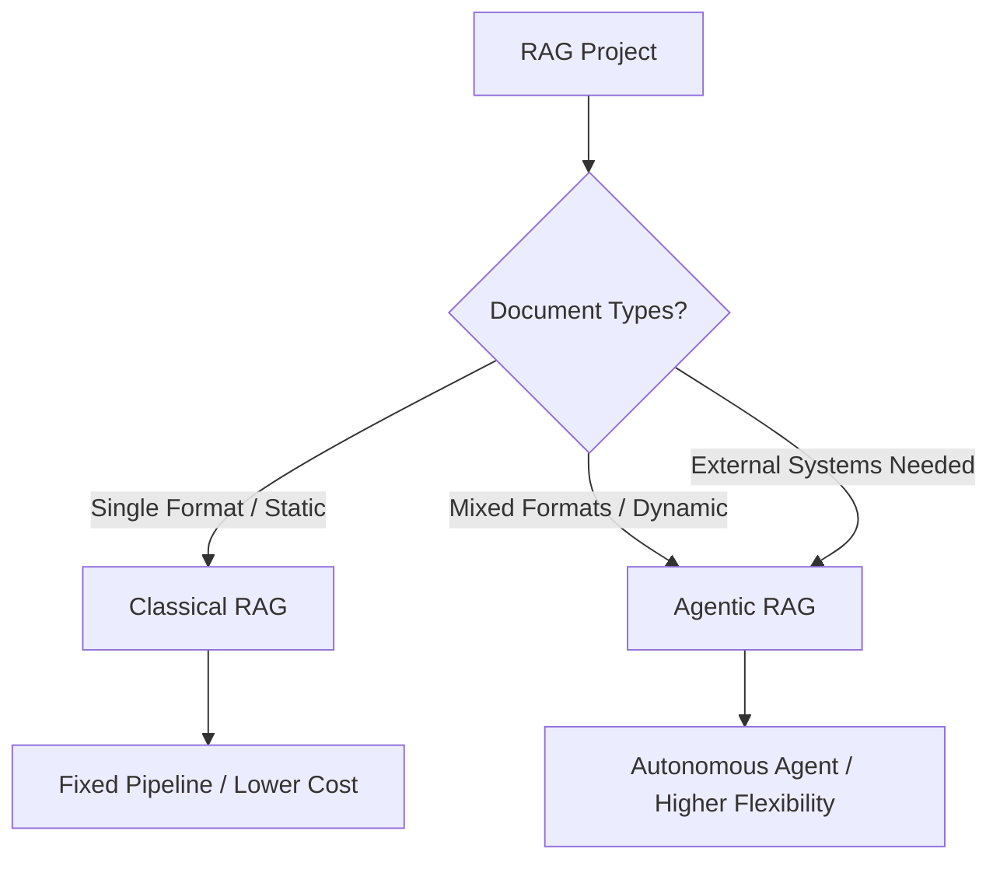

# RAG Architecture Selection Guide

[](https://python.org)
[](#)
[](#)
[](https://www.trychroma.com)
[](LICENSE)

This repository provides two end-to-end RAG infrastructures for building document assistants and archive query systems: **Classical RAG** and **Agentic RAG**. If you are unsure which one fits your project (`/Classical-RAG` or `/Agentic-RAG`), work through the decision questions below.



A Turkish version of this guide is available in [README_tr.md](README_tr.md).

---

## Decision Questions

**1. Infrastructure and privacy - where will the system run?**
- A: Cloud. Data can be sent to external APIs.
- B: Local. Data cannot leave the company; privacy is mandatory.
  - 1.1 (if B): Do you have GPU capacity on your server? A: Yes / B: No, CPU only / C: Other (describe your hardware).

**2. Data flow - how will the system operate?**
- A: Static / corporate archive. Documents are uploaded once and rarely change.
- B: Dynamic / document assistant. Users continuously upload and delete documents in real time.

**3. Document type - what reading engine is needed?**
- A: Digital text only (PDFs with selectable text, Word, TXT, Excel). OCR not required.
- B: Scanned or complex documents (signed/stamped pages, photos, complex tables). OCR or Vision LLM required.

**4. Document language?**
- A: Turkish only / B: English only / C: Multilingual / D: Other (specify).

**5. Output format - what should the system return?**
- A: Free text (chat, summarization, assistant tone).
- B: Structured data (strict JSON or tables for another system).
- C: Custom template (describe it, e.g. return only invoice number and date).

**6. Content structure - how is the document organized?** (critical)
- A: Q&A / Excel - pairs are side by side, must not be split.
- B: HTML / web page - contains ads and menus, must be cleaned.
- C: Legal text / contract - split by clause numbers.
- D: Mixed / multi-format - Word, scanned invoices, Excel, images coexist.

**7. External system connections needed?**
- A: No, RAG runs only over the uploaded archive.
- B: Yes, connections to external systems are required.
  - 7.1 (if B): Which systems and what operations? (e.g. pull from PostgreSQL by customer ID, live web search, open a CRM ticket.)

**8. Anything else?**
- Any special requirement, budget constraint, or hardware detail not covered above.

---

## Routing

### Option 1: Agentic RAG (autonomous assistant)

Choose this if one or more of the following apply:
- You selected "D (mixed format)" in question 6.
- Documents are dynamic (2  B) and you want the system to autonomously select tools (MCPs) based on the incoming file.
- You selected "B" in question 7 and need external system connections (database, API, CRM).
- You need different output templates per scenario (5  C).

Approach: the LLM acts as an orchestrator, directing MCPs (reader, database, external tools) and deciding which tool to use per document and query.

Folder: [`/Agentic-RAG/README.md`](./Agentic-RAG/README.md)

### Option 2: Classical RAG (fixed pipeline)

Choose this if:
- Your document type is fixed (only HTML, only plain PDF, or only Excel).
- Your data is static (2  A) and rarely changes.
- You do not need external connections (7  A).
- You want a deterministic system with predictable behavior and minimal server/API cost.
- Your GPU capacity is limited (1.1  B) and you prefer lightweight models.

Approach: the LLM only generates answers. All reading, parsing, and storage go through a fixed rule-based pipeline; the LLM has no autonomous decision authority.

Folder: [`/Classical-RAG/README.md`](./Classical-RAG/README.md)

---

## Quick Comparison

| Criteria | Agentic RAG | Classical RAG |
|---|---|---|
| Decision maker | LLM (autonomous) | Developer (fixed rules) |
| Document variety | Multiple and mixed | Single type and fixed |
| External connections | Supported via MCP | Local archive only |
| Cost | Higher (more LLM calls) | Lower (single-pass) |
| Flexibility | High (easy to add tools) | Low (requires pipeline changes) |
| Predictability | Lower (depends on LLM) | High (deterministic) |
| Setup complexity | Medium-high | Low-medium |

### Document nature determines the architecture

**Static documents** (e.g. customer-support assistant, product-manual bot): prepared in advance, rarely updated, users only ask questions. Parser services run once and shut down; only query services stay up.

**Dynamic documents** (e.g. user-uploaded document analysis, PDF reader bot): each user uploads different files, processed instantly. All services (parser, vector DB, query) stay up; the LLM decides which tool to use per document.

Rule of thumb: if users can upload documents, use the dynamic architecture; if they only query pre-loaded documents, use the static one.

---

## Project Structure

```
rag-master-class/
├── README.md                  # Architecture selection guide (EN)
├── README_tr.md               # Architecture selection guide (TR)
├── Classical-RAG/
│   ├── chunking.py            # Preprocessing & chunking (Streamlit app)
│   ├── config.py              # Embedding model configuration
│   ├── demo_pipeline.py       # End-to-end demo (ChromaDB + LLM)
│   ├── requirements.txt
│   ├── README.md / README_tr.md
├── Agentic-RAG/
│   ├── agent_demo.py          # Agentic demo (autonomous tool selection)
│   ├── tools.py               # Tool definitions (VectorSearch, WebSearch)
│   ├── requirements.txt
│   ├── README.md / README_tr.md
├── examples/data/             # Sample text, CSV, PDF
├── evaluation/
│   ├── evaluate.py            # Faithfulness, relevancy, precision
│   ├── qa_pairs.json
│   └── requirements.txt
├── docker-compose.yml         # ChromaDB + Ollama
├── Makefile                   # setup, demo, evaluate, clean
├── .env.example
├── CONTRIBUTING.md / CONTRIBUTING_tr.md
└── LICENSE
```

## Quick Links

| Component | Description |
|---|---|
| [Classical-RAG/](./Classical-RAG/) | Classical RAG pipeline: preprocessing, chunking, end-to-end demo |
| [Agentic-RAG/](./Agentic-RAG/) | Agentic RAG: autonomous tool selection and agent loop |
| [examples/data/](./examples/data/) | Sample data for the demos |
| [evaluation/](./evaluation/) | RAG quality evaluation (faithfulness, relevancy, precision) |
| [CONTRIBUTING.md](./CONTRIBUTING.md) | Contribution guidelines |
| [LICENSE](./LICENSE) | MIT License |

---

## License

[MIT](LICENSE).