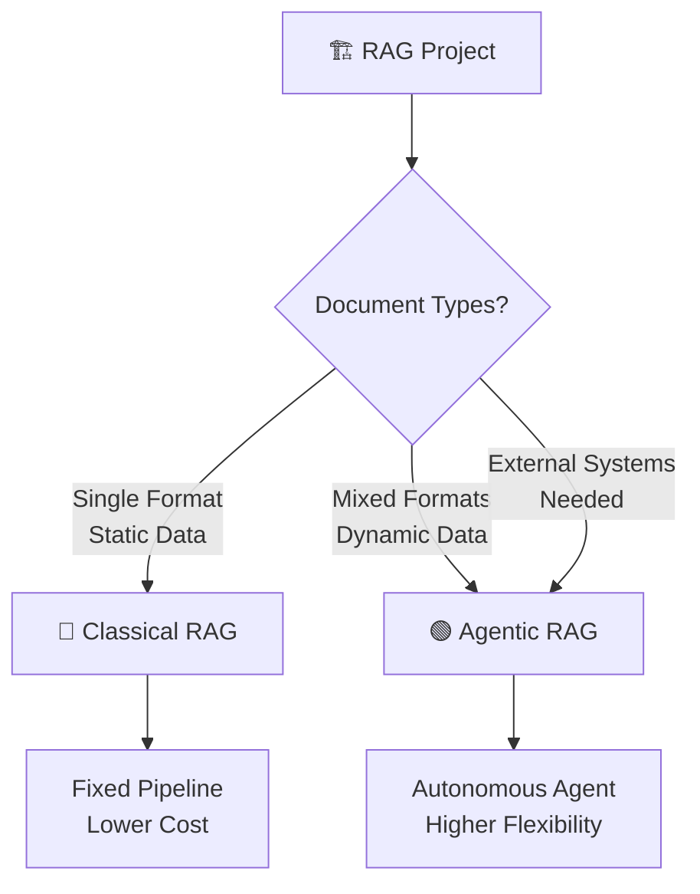

# 🏗️ RAG ARCHITECTURE SELECTION GUIDE (Master Class)



This repository offers two different end-to-end infrastructures for architects who want to build AI-powered Document Assistants and Archive Query Systems (RAG): **Classic RAG** and **Agentic RAG**.

If you're not sure which folder (`/Classical-RAG` or `/Agentic-RAG`) you should go to, solve the **Architect's Decision Tree** questionnaire below to find the right path for your project.

---

## ❓ THE ARCHITECT'S 8 GOLDEN QUESTIONS

Answer the following questions based on your project's needs.

---

### Question 1: Infrastructure and Privacy (Where will the system run?)
*   **A:** Cloud — Data can be sent outside the company (to APIs).
*   **B:** Local — Data absolutely cannot leave the company, privacy is mandatory.

> **Sub-Question 1.1** *(Asked only if "B" is selected in Question 1):*
> Do you have GPU (Graphics Card) power on your server?
> *   **A:** Yes, we have powerful GPUs.
> *   **B:** No, we only have CPUs.
> *   **C:** Other / You can write your system hardware details here in detail. *(Open Text Area)*

---

### Question 2: Data Flow and Usage Type (How will the system operate?)
*   **A:** Static / Corporate Archive: Documents are uploaded once and rarely change.
*   **B:** Dynamic / Document Assistant: Users can continuously upload and delete new documents in real-time.

---

### Question 3: Document Type (What kind of reading engine is needed?)
*   **A:** Only Digital Text: PDFs with selectable text, Word, TXT, Excel. (OCR is not required).
*   **B:** Visual and Challenging Documents: Scanned documents, signed/stamped pages, photos, or complex PDF tables. (OCR or Vision LLM is mandatory).

---

### Question 4: Language of the Documents?
*   **A:** Turkish Only
*   **B:** English Only
*   **C:** Multilingual (Mixed)
*   **D:** Other / You can specify the predominant languages or special cases here. *(Open Text Area)*

---

### Question 5: Output Format (What should the AI provide you?)
*   **A:** Free Text: Natural chat, summarization, normal assistant tone.
*   **B:** Structured Data: Strict JSON or Table format to feed into another system/API.
*   **C:** I Want a Custom Template / Detail the custom template you want in the output. *(Open Text Area — E.g.: Return only Invoice No and Date).*

---

### Question 6: Content Structure (How is the inside of the document designed?) ⭐ CRITICAL QUESTION
*   **A:** Q&A / Excel: Questions and answers are side-by-side, they must not be split in the middle.
*   **B:** HTML / Web Page: Contains junk like ads and menus, must be cleaned.
*   **C:** Legal Text / Contract: Must be split according to clause numbers (Clause 1, 2).
*   **D:** Mixed / Multi-Format: Word, Scanned Invoices, Excel, and Images coexist in the archive.

---

### Question 7: Need for Extra Connections and Features (External Systems)
*   **A:** No, RAG will be performed only over the uploaded documents/archive.
*   **B:** Yes, connection to external systems alongside RAG is required.

> **Sub-Question 7.1** *(Asked only if "B" is selected in Question 7):*
> External System Connection Details — Which systems will be connected and what will be done? Please provide details.
> *(Open Text Area — E.g.: Data will be pulled from a PostgreSQL database based on customer ID, a live internet search will be performed, a ticket will be opened in CRM).*

---

### Question 8: Other Details You Want to Add
*   **A:** No extra details.
*   **B:** Yes / Write any special requirement, budget constraint, hardware detail, or any other information not asked above regarding your project here. *(Large Text Area)*

---

## 🚀 DIAGNOSIS AND ROUTING

You've provided your answers. Now it's time to choose the right folder (architecture) for your project:

---

### 🟢 OPTION 1: AGENTIC RAG (Autonomous Super Assistant)

**Who Should Choose This?**

You should choose this architecture if **one or more** of the following apply to you:

*   You selected **"D (Mixed Format)" in Question 6**.
*   Your documents are dynamic (Question 2 → B) and you want the system to *autonomously decide and switch tools (MCPs)* based on the incoming file.
*   You selected **"B" in Question 7** and need to connect to external systems (database, API, CRM, etc.) alongside RAG.
*   You want different templates for different scenarios as output format (Question 5 → C).

**Philosophy:** The LLM is a Manager. It operates autonomously by directing the MCPs (Reader, Database, External Tools) under its command. It decides on its own which tool to use based on the incoming document type and query.

**Go to Folder:** 👉 **[🤖 `/Agentic-RAG/README.md`](./Agentic-RAG/README.md)**

---

### 🔵 OPTION 2: CLASSIC RAG (Fixed Pipeline)

**Who Should Choose This?**

You should choose this architecture if the following describe your project:

*   Your document type is fixed (E.g.: Only HTML, Only Plain PDF, or Only Excel).
*   Your data is static (Question 2 → A) and rarely changes.
*   You don't need external system connections (Question 7 → A).
*   You want to build a **deterministic** system that runs like clockwork with no surprises, while keeping server/API costs to a minimum.
*   Your GPU power is limited (Question 1.1 → B) and you prefer lightweight models.

**Philosophy:** The LLM only generates answers. All reading, parsing, and saving operations go through a strict rule-based pipeline that you write. The flow is predetermined; the LLM has no autonomous decision-making authority.

**Go to Folder:** 👉 **[⚙️ `/Classical-RAG/README.md`](./Classical-RAG/README.md)**

---

## 📊 QUICK COMPARISON TABLE

| Criteria | 🟢 Agentic RAG | 🔵 Classic RAG |
|---|---|---|
| **Decision Maker** | LLM (Autonomous) | Developer (Fixed Rules) |
| **Document Variety** | Multiple & Mixed | Single Type & Fixed |
| **External Connections** | ✅ Supported via MCP | ❌ Local archive only |
| **Cost** | Higher (more LLM calls) | Lower (single-pass pipeline) |
| **Flexibility** | High (easy to add new tools) | Low (requires pipeline changes) |
| **Error Predictability** | Low (depends on LLM decisions) | High (deterministic flow) |
| **Setup Complexity** | Medium-High | Low-Medium |

---

### ⚡ CRITICAL POINT: Your Documents' Nature Determines the Architecture

Your system's architecture must be built in fundamentally different ways depending on **whether your documents change continuously or not**:

**📌 Static Documents (Unchanging Content):**
- Example: Company customer support assistant, product manual assistant, company policy bot
- Documents are prepared in advance and rarely updated
- Users only ask questions, they don't upload documents
- **Architecture:** Document processing services (Parser MCPs) run once and are shut down. Only query services stay up.

**📌 Dynamic Documents (Continuously Changing Content):**
- Example: Document analysis assistant where users can upload their own documents, PDF reader bot
- Each user uploads different documents
- The system must process each new document instantly
- **Architecture:** All services (Parser + Vector DB + Query) must stay up at all times. The LLM dynamically decides which tool to use for each document.

**💡 Simple Rule:** If your users can upload documents to the system → Dynamic architecture. If they only ask questions from pre-loaded documents → Static architecture.

---

## 📁 Project Structure

```
rag-master-class/
├── README.md                          # Architecture selection guide (EN)
├── README_tr.md                       # Architecture selection guide (TR)
├── Classical-RAG/
│   ├── chunking.py                    # Document preprocessing & chunking (Streamlit app)
│   ├── config.py                      # Embedding model configuration
│   ├── demo_pipeline.py               # End-to-end RAG demo (ChromaDB + LLM)
│   ├── requirements.txt               # Python dependencies
│   ├── README.md                      # Classical RAG architecture guide (EN)
│   └── README_tr.md                   # Classical RAG architecture guide (TR)
├── Agentic-RAG/
│   ├── agent_demo.py                  # Agentic RAG demo (autonomous tool selection)
│   ├── tools.py                       # Tool definitions (VectorSearch, WebSearch)
│   ├── requirements.txt               # Python dependencies
│   ├── README.md                      # Agentic RAG architecture guide (EN)
│   └── README_tr.md                   # Agentic RAG architecture guide (TR)
├── examples/
│   └── data/
│       ├── sample.txt                 # Sample text document (RAG concepts)
│       ├── sample.csv                 # Sample Q&A pairs
│       └── sample.pdf                 # Sample PDF (RAG architecture)
├── evaluation/
│   ├── evaluate.py                    # RAG evaluation script (Faithfulness, Relevancy, Precision)
│   ├── qa_pairs.json                  # Evaluation Q&A pairs
│   └── requirements.txt               # Evaluation dependencies
├── docker-compose.yml                 # ChromaDB + Ollama services
├── Makefile                           # Shortcut commands (setup, demo, evaluate, clean)
├── .env.example                       # Environment variables template
├── .gitignore                         # Git ignore patterns
├── CONTRIBUTING.md                    # Contribution guidelines (EN)
├── CONTRIBUTING_tr.md                 # Contribution guidelines (TR)
└── LICENSE                            # MIT License
```

## 🔗 Quick Links

| Component | Description |
|-----------|-------------|
| [Classical-RAG/](./Classical-RAG/) | Classical RAG pipeline with preprocessing, chunking, and end-to-end demo |
| [Agentic-RAG/](./Agentic-RAG/) | Agentic RAG with autonomous tool selection and agent loop |
| [examples/data/](./examples/data/) | Sample data files for testing the demos |
| [evaluation/](./evaluation/) | RAG quality evaluation with Faithfulness, Relevancy, and Precision metrics |
| [CONTRIBUTING.md](./CONTRIBUTING.md) | Contribution guidelines |
| [LICENSE](./LICENSE) | MIT License |

---

## 🧭 STILL UNSURE?

If you're still not sure which architecture to choose, don't worry. You can get help from an expert or create your custom RAG plan through our website:

👉 **[howtorag.com](https://howtorag.com)**