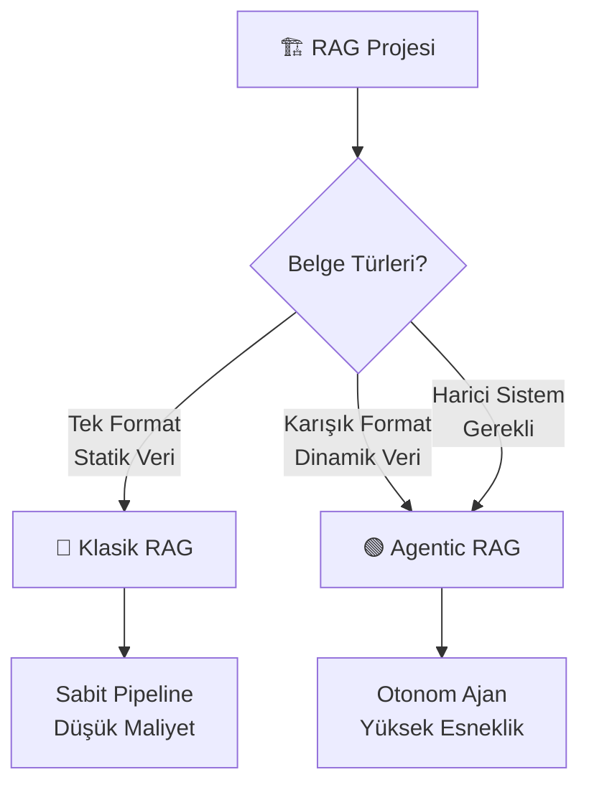

# 🏗️ RAG MİMARİSİ SEÇİM REHBERİ (Master Class)



Bu depo (repository), Yapay Zeka destekli Doküman Asistanı ve Arşiv Sorgulama Sistemleri (RAG) kurmak isteyen mimarlar için iki farklı uçtan uca altyapı sunar: **Klasik RAG** ve **Agentic RAG**.

Hangi klasöre (`/Classical-RAG` veya `/Agentic-RAG`) gitmeniz gerektiğinden emin değilseniz, aşağıdaki **Mimarın Karar Ağacı** anketini çözerek projeniz için en doğru yolu bulun.

---

## ❓ MİMARIN 8 ALTIN SORUSU

Aşağıdaki soruları projenizin ihtiyaçlarına göre cevaplayın.

---

### Soru 1: Altyapı ve Gizlilik (Sistem nerede çalışacak?)
*   **A:** Bulut (Cloud) / Veriler şirket dışına (API'lere) çıkabilir.
*   **B:** Yerel (Local) / Veri kesinlikle şirket dışına çıkamaz, gizlilik zorunludur.

> **Alt Soru 1.1** *(Yalnızca Soru 1'de "B" seçildiyse sorulur):*
> Sunucunuzda GPU (Ekran Kartı) gücünüz var mı?
> *   **A:** Evet, güçlü GPU'larımız var.
> *   **B:** Hayır, yalnızca CPU'larımız var.
> *   **C:** Diğer / Sistem donanım detaylarınızı buraya ayrıntılı olarak yazabilirsiniz. *(Açık Metin Alanı)*

---

### Soru 2: Veri Akışı ve Kullanım Tipi (Sistem nasıl çalışacak?)
*   **A:** Statik / Kurumsal Arşiv: Belgeler bir kez yüklenir, nadiren değişir.
*   **B:** Dinamik / Doküman Asistanı: Kullanıcılar anlık olarak sürekli yeni belge yükleyip silebilir.

---

### Soru 3: Belge Türü (Nasıl bir okuma motoru lazım?)
*   **A:** Sadece Dijital Metin: Seçilebilir PDF, Word, TXT, Excel. (OCR gerekmez).
*   **B:** Görsel ve Zorlu Belgeler: Taranmış evrak, imza/mühür, fotoğraf veya karmaşık PDF tabloları. (OCR veya Vision LLM şarttır).

---

### Soru 4: Belgelerin Dili Nedir?
*   **A:** Sadece Türkçe
*   **B:** Sadece İngilizce
*   **C:** Çok Dilli (Karışık)
*   **D:** Diğer / Ağırlıklı dilleri veya özel durumları buraya belirtebilirsiniz. *(Açık Metin Alanı)*

---

### Soru 5: Çıktı Formatı (Yapay Zeka size ne versin?)
*   **A:** Serbest Metin: Doğal sohbet, özetleme, normal asistan dili.
*   **B:** Yapılandırılmış Veri: Başka bir sisteme/API'ye beslenecek kesin JSON veya Tablo formatı.
*   **C:** Özel Şablon İstiyorum / Çıktıda istediğiniz özel şablonu detaylandırın. *(Açık Metin Alanı — Örn: Yalnızca Fatura No ve Tarih dönsün).*

---

### Soru 6: İçerik Yapısı (Belgenin içi nasıl tasarlanmış?) ⭐ KRİTİK SORU
*   **A:** Soru-Cevap (Q&A) / Excel: Soru ve cevap yan yanadır, ortadan bölünmemelidir.
*   **B:** HTML / Web Sayfası: İçinde reklam, menü gibi çöpler vardır, temizlenmesi gerekir.
*   **C:** Hukuki Metin / Sözleşme: Madde numaralarına göre (Madde 1, 2) ayrılmalıdır.
*   **D:** Karışık / Çoklu Format: Arşivde Word, Taranmış Fatura, Excel ve Resimler bir arada duruyor.

---

### Soru 7: Harici Bağlantı ve Özellik İhtiyacı (Dış Sistemler)
*   **A:** Hayır, RAG yalnızca yüklenen belgeler/arşiv üzerinden yapılacak.
*   **B:** Evet, RAG'ın yanı sıra harici sistemlere bağlantı gerekiyor.

> **Alt Soru 7.1** *(Yalnızca Soru 7'de "B" seçildiyse sorulur):*
> Harici Sistem Bağlantı Detayları — Hangi sistemlere bağlanılacak ve ne yapılacak? Lütfen detay verin.
> *(Açık Metin Alanı — Örn: Müşteri ID'sine göre PostgreSQL veritabanından veri çekilecek, canlı internet araması yapılacak, CRM'de ticket açılacak).*

---

### Soru 8: Eklemek İstediğiniz Diğer Detaylar
*   **A:** Ekstra detay yok.
*   **B:** Evet / Projenizle ilgili yukarıda sorulmayan her türlü özel gereksinimi, bütçe kısıtını, donanım detayını veya diğer bilgiyi buraya yazın. *(Geniş Metin Alanı)*

---

## 🚀 TEŞHİS VE YÖNLENDİRME

Cevaplarınızı verdiniz. Şimdi projeniz için doğru klasörü (mimariyi) seçme vakti:

---

### 🟢 TERCİH 1: AGENTIC RAG (Otonom Süper Asistan)

**Kimler Seçmeli?**

Aşağıdaki durumlardan **bir veya birkaçı** sizin için geçerliyse bu mimariyi seçmelisiniz:

*   **Soru 6'da "D (Karışık Format)"** seçeneğini işaretlediyseniz.
*   Belgeleriniz dinamikse (Soru 2 → B) ve sistemin gelen dosyaya göre *kendi kendine karar verip araç (MCP) değiştirmesini* istiyorsanız.
*   **Soru 7'de "B"** seçerek RAG'ın yanı sıra harici sistemlere (veritabanı, API, CRM vb.) de bağlanma ihtiyacınız varsa.
*   Çıktı formatı olarak farklı senaryolarda farklı şablonlar istiyorsanız (Soru 5 → C).

**Felsefesi:** LLM bir Müdürdür. Emrindeki MCP'leri (Okuyucu, Veritabanı, Harici Araçlar) yöneterek otonom çalışır. Gelen belge türüne ve sorguya göre hangi aracı kullanacağına kendisi karar verir.

**Gidilecek Klasör:** 👉 **[🤖 `/Agentic-RAG/README.md`](./Agentic-RAG/README.md)**

---

### 🔵 TERCİH 2: KLASİK RAG (Sabit Boru Hattı)

**Kimler Seçmeli?**

Aşağıdaki durumlar sizin projenizi tanımlıyorsa bu mimariyi seçmelisiniz:

*   Belge türünüz sabitse (Örn: Sadece HTML, Sadece Düz PDF veya Sadece Excel).
*   Verileriniz statikse (Soru 2 → A) ve nadiren değişiyorsa.
*   Harici sistem bağlantısına ihtiyacınız yoksa (Soru 7 → A).
*   Sunucu/API maliyetini minimumda tutarak sürprizsiz, saat gibi işleyen **deterministik** bir sistem kurmak istiyorsanız.
*   GPU gücünüz kısıtlıysa (Soru 1.1 → B) ve hafif modeller tercih ediyorsanız.

**Felsefesi:** LLM sadece cevap üretir. Tüm okuma, ayrıştırma (parsing) ve kaydetme işlemleri sizin yazdığınız katı kurallı bir boru hattından (Pipeline) geçer. Akış önceden belirlenmiştir, LLM'in otonom karar alma yetkisi yoktur.

**Gidilecek Klasör:** 👉 **[⚙️ `/Classical-RAG/README.md`](./Classical-RAG/README.md)**

---

## 📊 HIZLI KARŞILAŞTIRMA TABLOSU

| Kriter | 🟢 Agentic RAG | 🔵 Klasik RAG |
|---|---|---|
| **Karar Verici** | LLM (Otonom) | Geliştirici (Sabit Kurallar) |
| **Belge Çeşitliliği** | Çoklu & Karışık | Tek Tip & Sabit |
| **Harici Bağlantılar** | ✅ MCP ile desteklenir | ❌ Sadece yerel arşiv |
| **Maliyet** | Daha yüksek (daha fazla LLM çağrısı) | Daha düşük (tek geçişli pipeline) |
| **Esneklik** | Yüksek (yeni araç eklemek kolay) | Düşük (pipeline değişikliği gerekir) |
| **Hata Öngörülebilirliği** | Düşük (LLM kararlarına bağlı) | Yüksek (deterministik akış) |
| **Kurulum Karmaşıklığı** | Orta-Yüksek | Düşük-Orta |

---

### ⚡ KRİTİK NOKTA: Belgelerinizin Yapısı Mimariyi Belirler

Sisteminizin mimarisi, **belgelerinizin sürekli değişip değişmediğine** göre tamamen farklı şekillerde kurulmalıdır:

**📌 Statik Belgeler (Değişmeyen İçerik):**
- Örnek: Şirket müşteri destek asistanı, ürün kılavuzu asistanı, şirket politika botu
- Belgeler önceden hazırlanır ve nadiren güncellenir
- Kullanıcılar sadece soru sorar, belge yüklemez
- **Mimari:** Belge işleme servisleri (Parser MCP'ler) bir kere çalışır ve kapatılır. Sadece sorgu servisleri ayakta kalır.

**📌 Dinamik Belgeler (Sürekli Değişen İçerik):**
- Örnek: Kullanıcıların kendi belgelerini yükleyebildiği doküman analiz asistanı, PDF okuyucu bot
- Her kullanıcı farklı belgeler yükler
- Sistem her yeni belgeyi anında işlemeli
- **Mimari:** Tüm servisler (Parser + Vector DB + Query) sürekli ayakta olmalıdır. LLM her belgeye göre hangi aracı kullanacağına dinamik karar verir.

**💡 Basit Kural:** Eğer kullanıcılarınız sisteme belge yükleyebiliyorsa → Dinamik mimari. Eğer sadece hazır belgelerden soru soruyorlarsa → Statik mimari.

---

## 📁 Proje Yapısı

```
rag-master-class/
├── README.md                          # Mimari seçim rehberi (EN)
├── README_tr.md                       # Mimari seçim rehberi (TR)
├── Classical-RAG/
│   ├── chunking.py                    # Belge ön işleme & parçalama (Streamlit uygulaması)
│   ├── config.py                      # Embedding model yapılandırması
│   ├── demo_pipeline.py               # Uçtan uca RAG demo (ChromaDB + LLM)
│   ├── requirements.txt               # Python bağımlılıkları
│   ├── README.md                      # Klasik RAG mimari rehberi (EN)
│   └── README_tr.md                   # Klasik RAG mimari rehberi (TR)
├── Agentic-RAG/
│   ├── agent_demo.py                  # Agentic RAG demo (otonom araç seçimi)
│   ├── tools.py                       # Araç tanımları (VektörArama, WebArama)
│   ├── requirements.txt               # Python bağımlılıkları
│   ├── README.md                      # Agentic RAG mimari rehberi (EN)
│   └── README_tr.md                   # Agentic RAG mimari rehberi (TR)
├── examples/
│   └── data/
│       ├── sample.txt                 # Örnek metin belgesi (RAG kavramları)
│       ├── sample.csv                 # Örnek soru-cevap çiftleri
│       └── sample.pdf                 # Örnek PDF (RAG mimarisi)
├── evaluation/
│   ├── evaluate.py                    # RAG değerlendirme scripti (Faithfulness, Relevancy, Precision)
│   ├── qa_pairs.json                  # Değerlendirme soru-cevap çiftleri
│   └── requirements.txt               # Değerlendirme bağımlılıkları
├── docker-compose.yml                 # ChromaDB + Ollama servisleri
├── Makefile                           # Kısayol komutları (setup, demo, evaluate, clean)
├── .env.example                       # Ortam değişkenleri şablonu
├── .gitignore                         # Git hariç tutma desenleri
├── CONTRIBUTING.md                    # Katkıda bulunma rehberi (EN)
├── CONTRIBUTING_tr.md                 # Katkıda bulunma rehberi (TR)
└── LICENSE                            # MIT Lisansı
```

## 🔗 Hızlı Bağlantılar

| Bileşen | Açıklama |
|---------|----------|
| [Classical-RAG/](./Classical-RAG/) | Ön işleme, parçalama ve uçtan uca demo ile Klasik RAG pipeline |
| [Agentic-RAG/](./Agentic-RAG/) | Otonom araç seçimi ve ajan döngüsü ile Agentic RAG |
| [examples/data/](./examples/data/) | Demo'ları test etmek için örnek veri dosyaları |
| [evaluation/](./evaluation/) | Faithfulness, Relevancy ve Precision metrikleri ile RAG kalite değerlendirmesi |
| [CONTRIBUTING_tr.md](./CONTRIBUTING_tr.md) | Katkıda bulunma rehberi |
| [LICENSE](./LICENSE) | MIT Lisansı |

---

## 🧭 KARARSIZ MISINIZ?

Hangi mimariyi seçeceğinizden hâlâ emin değilseniz endişelenmeyin. Bir uzmandan yardım alabilir veya sitemiz üzerinden projenize özel RAG planınızı oluşturabilirsiniz:

👉 **[howtorag.com](https://howtorag.com)**